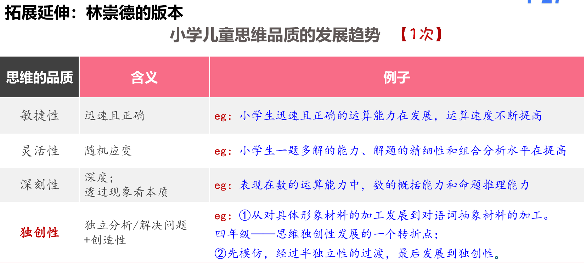

占比：基本教育学=心理学=40 分左右


章节比重：


# 章节：一、教育心理学概述【⭐，大概 1 分】

## 第 1.1 节：研究对象【单选、多选】

教育心理学的研究对象：【单选、多选】

- 研究<font color="#ff0000">教育教学情境中</font>，<font color="#ff0000"><b>学与教的基本心理规律</b></font>的科学。主要研究对象是学生
- 研究课题：<font color="#ff0000">如何学、如何教以及学与教之间的相互作用</font>。

补充：3 个人【背诵，全部，包括时间】

- 夸美纽斯：教育学之父。1632 年出版的<font color="#ff0000">《大教学论》</font>，标志着教育学成为一门独立学科
- 冯特：心理学之父。1879 年在德国莱比锡大学建立世界上<font color="#ff0000">第一个心理学实验室</font>，标志着科学心理学的诞生，也标志着心理学从哲学中分离出来，作为一门独立的科学正式诞生
- <span style="background:#fff88f">桑代克</span>：教育心理学之父。1903 年出版的<font color="#ff0000">《教育心理学》</font>是<font color="#ff0000">西方第一部</font>以“教育心理学” 命名的专著，标志着西方教育心理学独立学科体系的确立

## 第 1.2 节：学科性质【单选、多选、判断】

教育心理学的学科性质：交叉

- <font color="#ff0000">教育学和心理学的交叉学科</font>：不是应用/一般心理学的下级
  - 心理学：吸引注意力、快速掌握
  - 教育心理学和心理学是一般与特殊的关系 ❌ 说反了，心理学范围更大，教育心理学才是特殊
  - 教育心理学是普通心理学在教育领域的**简单应用**❌ 已经有自己独特的理论体系了，有自己的特殊性
- <font color="#ff0000">自然科学与人文科学的交叉</font>：实验+人之间的关系(师生间关系)
- <font color="#ff0000">理论性与应用性并重，以应用为主</font>：理论的学习是为了应用
  - <font color="#ff0000">具体问题具体分析</font>，每个学生情况不同
  - 理论大于应用，理论为主应用为辅 ❌

## 第 1.3 节：研究内容【单选、多选、判断】

教育心理学的研究内容：五三。<font color="#5F479A" size=5><b>口诀:教师在教学环境中用教学媒体教学生教学内容</b></font>

### 1.3.1 五要素

五要素：学生、教师、教学内容、教学媒体、教学环境

学生：

> - 地位：<font color="#ff0000">主体，最主要的研究对象，最活跃的因素</font>
> - <u>群体差异</u>(年龄、性别、社会文化)。学生<font color="#ff0000">年龄差异</font>主要体现在<font color="#ff0000">思维水平</font>的差异<font color="#5F479A" size=5><b>口诀:年性社</b></font>
> - 个体差异(知识基础、学习方式、智力水平、兴趣、需要)，除了年性社之外
> - 群体差异和个体差异均重要，均要研究

教师：指导地位。起主导和关键作用

> - 教师主导与学生主体相统一
> - 维持良好师生关系的关键要素是<font color="#ff0000">教师</font>

教学内容：

> - 含义：<font color="#ff0000">学什么</font>
> - 学与教的过程中<u>有意识传递</u>的<font color="#ff0000">主要信息部分</font>(提前预设讲什么)
> - 一般表现为<font color="#ff0000">课程标准、教材和课程</font>等(知识、技能、策略、态度、价值观)
> - 联系学生与教师的<font color="#ff0000">中介因素</font>

教学媒体：

> - 用什么来传达教学内容：载体；表现形式；工具
> - 实物、<font color="#ff0000">文字、口头语言</font>、图表、图像、录音、录像等
> - 教学媒体的选择依据【2021 年四川特岗简答】<font color="#5F479A" size=5><b>口诀:树精目对象</b></font>
>   - 依据教学<font color="#ff0000">目标</font>选择教学媒体：观察课-录像；对比-PPT
>   - 依据教学<font color="#ff0000">对象</font>的特点选用教学媒体
>   - 依据媒体的技<font color="#ff0000">术</font>特性选择教学媒体
>   - 依据<font color="#ff0000">经</font>济条件选择教学媒体

教学环境：

> - 物质环境、社会环境
>   - 物质环境：看得见摸得着。包括课堂自然条件(如温度和照明等)、空间布置(如座位的排列等)以及教学设施(如桌椅、黑板和投影仪等)
>   - 社会环境：包括课堂纪律、课堂气氛、师生关系、同学关系、校风以及社会文化背景等
> - 地位：不仅是<font color="#ff0000">课堂管理研究的主要范畴</font>，也是学习过程研究和教学设计研究所<font color="#ff0000">不能忽视的重要内容</font>

### 1.3.2 三过程

三过程：学习过程（核心）、教学过程、评价/反思过程

- <span style="background:#fff88f"><font color="#ff0000">学习</font></span>过程：【单选，地位】是<span style="background:#fff88f"><font color="#ff0000">研究的核心</font></span>内容。<font color="#ff0000">研究最早、理论最多</font>。
- 教学过程：设计+组织
- 评价/反思过程：【判断】贯穿教学的始终。教学前中后
  - 若题干是多选：A.学习过程 B.教学过程 C.反思过程 D.管理过程 → 则选 ABC
  - 若题干是多选：A.学习过程 B.教学过程<font color="#ff0000">C.反思过程 D.评价过程</font>→ 则选 ABCD，可以拆开

注意混淆点的区分：


<!-- tab 单选题目1 -->

教育心理学研究的<span style="background:#fff88f"><font color="#ff0000">核心</font></span>内容是（ ）。
<font color="#ff0000">A.学习过程</font>
B.教育过程
C.教学过程
D.发展过程

<!-- endtab -->
<!-- tab 单选题目2 -->

教育心理学的主要研究<span style="background:#fff88f"><font color="#ff0000">对象</font></span>是（ ）。
<font color="#ff0000">A.学生</font>
B.教师
C.学习
D.教学

<!-- endtab -->



<span style="background:#fff88f"><b><font color="#ff0000">当问到对象时，优先选择学生，次选学习。</font></b></span>对象是人，内容是事。

考背诵就直接选，但是变形题也要会变通

```markdown
教育心理学的主要研究 对象 集中在（ ）方面
A.反思 B.教学 C.学习 D.评价

教育心理学的研究内容包括学习心理、教学心理、学生心理和教师心理四大部分，其中，学习心理是教育心理学的核心(正确)
```

## 第 1.4 节：教育心理学的研究原则【单选、多选】

<font color="#5F479A" size=5><b>口诀:教官喜(欢)理发</b></font>

- 教育性/伦理性原则：有道德，无伤害$\Rightarrow$反例：华生 恐惧实验
- 客观性原则：实事求是。【地位】所有学科的研究都应该遵循的基本原则
- 系统性原则：整体的、动态的系统。把人当成一个整体动态的去研究$\Rightarrow$反例：头痛医头，脚痛医脚
- 理论联系实际原则：理论指导实践
- 发展性原则：变化发展的过程。既要看到过去，又要看到现在与将来

## 第 1.5 节：教育心理学的研究方法【单选】

实验法：

> 地位：应用<font color="#ff0000">最广泛、成就最大</font>
> 探讨因果关系：自变量(原因)、因变量(结果)$\Rightarrow$字号大小与成绩间的关系
> 唯一能探讨因果关系的方法，其他方法都是相关关系

观察法：

> 地位：<font color="#ff0000">最基本、最普遍</font>的方法
> 哪个学科都能用，性价比高
> 优点：保持了人的心理活动的自然性和客观性，而且获得的资料比较真实

调查法：访谈+问卷

个案法：一个案例(一个人、一个团体)

教育经验总结法：将经验上升到理论的高度

作品分析法：绘画、作文、日记

# 章节：二、心理学基础与教育【⭐，大概 6.1 分】

波动较大


## 第 2.1 节：学生的认知发展与教育

### 2.1.1 感觉

#### 感觉概念

感觉：直接作用于<font color="#ff0000">感觉器官</font>(眼睛、鼻子、耳朵)的客观事物的<font color="#ff0000">个别属性</font>(视觉、嗅觉)在人脑中的反映

> 地位：是一切心理活动产生的<font color="#ff0000">基础</font>；是个体认识世界的<font color="#ff0000">开端</font>。出生就有感觉
> 是最简单的认知过程；最先发展且速度最快的领域，认知的起点（开端）

感觉 VS 知觉


<!-- tab 感觉 -->

- 苹果很红
- 苹果很香
  <!-- endtab -->
  <!-- tab 知觉 -->
- 红红的，这是苹果
- 香香的，很好吃
  <!-- endtab -->
  

在感觉和知觉中，先选感觉；在感知觉和思维中，先选感知觉

感觉的产生条件：<font color="#5F479A" size=5><b>口诀:性能力，阈限值</b></font>

- 外界，<font color="#ff0000">感觉阈限：值</font>。温度
  - 绝对
  - 相对
- 内部，<font color="#ff0000">感受性：感受性与感受阈限成反比关系</font>。自身抗冻
  - 绝对感受性
  - 相对感受性

| 人   | 吃辣 | 感觉 | 能力       |
| ---- | ---- | ---- | ---------- |
| 张三 | 1g   | 好辣 | 灵敏，强   |
| 李四 | 10g  | 不辣 | 不灵敏，弱 |
|      |      |      |            |

#### 同一感觉的相互作用

适应：视觉适应、嗅觉适应、肤觉适应、听觉适应、味觉适应

- <font color="#ff0000">暗适应</font>（性提高）：光线/数值少了 → 能力增加。<font color="#ff0000">暗适应初期</font>感受性<font color="#ff0000">骤升</font>，感觉阈限<font color="#ff0000">骤降</font>。但是<font color="#ff0000">整个过程很缓慢</font>(30-40 分钟)
- 明适应（性降低）：整个过程很快(5 分钟)
- 嗅觉适应：入芝兰之室久而不闻其香，入鲍鱼之肆久而不闻其臭
- 肤觉适应：
  - 冬泳时刚开始觉得冷，一会就适应了
  - 泡脚时，刚开始觉得热一会就适应了
  - 忘足，履之适也
- 听觉适应：工厂里强烈的机器声长时间会引起听觉感受性的降低
- 味觉适应：老厨师做菜越做越咸

感觉对比：

- 同时对比：同时发生。红花绿叶、鹤立鸡群、月明星稀、黑人牙白、马赫带现象/边缘对比效应
- 继时对比：先后发生。
  - 先吃药再吃糖，糖更甜了
  - 先吃柠檬再吃西瓜，西瓜更甜了
  - 吃完糖葫芦再吃到山楂，感觉更酸了

感觉后效(后像)：

- 正后像（一致）：
  - 看完白炽灯/太阳光后看白墙，会觉得有灯/太阳的影子
  - 余音绕梁三日不绝于耳
  - 电影、连环画
- 负后像（不一致）

#### 不同感觉的相互作用【例子】

感觉的补偿作用：A 缺 B 补。盲人触觉、听觉灵敏。正常人也有取长补短

<font color="#ff0000">联觉：一个刺激 → 多种感觉</font>

- 通感：嗅到花香仿佛听到歌声
- 冷暖色调：
- 甜甜的声音/甜美的笑容：味觉+视觉
- 色听现象/有色听觉：听了钢琴曲，仿佛置身于黑色世界，觉得很压抑，就是联觉。音乐是听觉，黑色是视觉，这种属于有色听觉

感觉的<font color="#ff0000">相互影响</font>：A 感觉<font color="#ff0000">影响</font>B 感觉的<font color="#ff0000">感受性</font>。有好有坏

- 看着打针，更疼：皮肤+视觉冲击是 2 个刺激物，不是 1 个刺激物导致的 2 个感觉
- 凉水擦脸，视觉提高
- 微弱的音乐可提高味觉的感受性
- 柔和的灯光可提高听觉的感受性

联觉 VS 感觉：


<!-- tab 辨析 -->

联觉：<span style="background:#fff88f"><font color="#ff0000">一个刺激</font></span>→ 多种感觉
感觉的相互影响：多个刺激，$A感觉 \stackrel{影响}{\longrightarrow} B感觉$的<font color="#ff0000">感受性</font>(↑ 或者是 ↓)

<!-- endtab -->
<!-- tab 题目 -->

将心理咨询室的墙壁粉刷成淡粉色，使人进入心理咨询室有一种温暖的感觉，这是一种()
A.感觉对比
C.不同感觉相互代偿
B.感觉适应
D.联觉

```
D，只有一个刺激物，墙壁，温暖的肤觉+粉色的视觉
B是习惯了，C是A缺B补
```

2.【单选】在噪声的持续作用下拔牙时不觉得疼，是因为（ ）。
A.感觉适应
B.感觉对比
C.感觉的相互影响
D.实践的影响

```
C，噪声是听觉+不疼是痛觉
```

<!-- endtab -->



### 2.1.2 知觉【考频低，难】

#### 定义和种类【考 1 次】

定义：人脑对直接作用于感觉器官的客观事物<font color="#ff0000">整体属性</font>的反映
关键词：<span style="background:#fff88f"><font color="#ff0000">整体属性、认出、认识、识别出、命名</font></span>

> 拿出一个红苹果
> A 说红色的；B 说很甜；C 说好大；D 说是苹果 ✔ 识别出 → 认出某个颜色，是部分属性，感觉

```
有小学一年级学生把6与9混淆，这说明该生的（）还不成熟。A
A.感知能力：整体看6和9的圆圈位置
B.注意能力
C.记忆能力	D.思维能力：总结、解题(数学物理)
```

错觉【判断】

- 不正确的、歪曲的<span style="background:#fff88f"><font color="#ff0000">知觉</font></span>。
- 只要条件具备，必然产生，主观努力难以克服：笔在半杯水里像折断了
- 既有积极作用，又有消极作用：黑色显瘦、衣服横条纹显胖
- 错觉<span style="background:#fff88f"><font color="#ff0000">不是幻觉</font></span>：错觉有具体对象，幻觉没有具体对象，凭空出现
- 错觉有很多种：时间错觉
  - 欢娱嫌夜短，寂寞恨更长
  - 士别一日，如隔三秋

> 感觉：个别属性
> 知觉：整体属性
> 错觉：错误的知觉
> 幻觉：凭空出现

真动错觉：真的在动
似动错觉：好像在动

#### 知觉的基本特性【例子】

选择性/对象性：<font color="#ff0000">多选一，对象和背景</font>，选一个作为对象其他都是背景【不用背诵，理解例子】

> <font color="#ff0000">对象和背景的差别</font>： - 差别大：万绿从中一点红；红笔画重点；鹤立鸡群；白纸黑字 - 差别小：迷彩服、枯叶蝶、变色龙、冰天雪地的白熊
> <font color="#ff0000">活动与静止</font>：显眼包 - 天空中划过的流星、站军姿的时候只有你动了、大合唱只有你不张嘴
> 对象是自己熟悉的、感兴趣的： - 嘈杂的环境下听自己的名字 - 逛街女人看见包包、口红，男人看见电子产品、美女

理解性：原有知识经验，经验很重要，不同的人不同的经验，有不同的理解

> 经验不同，不同的人有不同的理解： - 一千个读者有一千个哈姆雷特 - 仁者见仁，智者见智 - 内行看门道，外行看热闹
> 言语解释，可以帮助加深理解：导游、老师。本身没有理解到，语言加深理解 - 游览黄山时见到一块石头，导游提示其很像一只雄鸡，此景点叫做“金鸡叫天门”，于是越看越像
> 理解性还受到情绪、动机、态度、任务的影响
> 人的知识经验越丰富，对事物的知觉就越精确、完整和深刻 ✔【判断】

选择性 VS 理解性


<!-- tab 区分 -->

选择性：两个以上的事物
理解性：同一个事物

<!-- endtab -->
<!-- tab 题目 -->

“樵夫进山<font color="#ff0000">只见柴草</font>，猎人进山<font color="#ff0000">只见禽兽</font>”，这种现象主要反映知觉的（ ）
A.选择性         B.整体性         C.理解性         D.恒常性

<font color="#ff0000">同一棵香樟树</font>，植物学家把它看作一种双子叶植物，而木匠则常称之为优秀木材这是（ ）的表现
A.选择性         B.整体性         C.理解性         D.恒常性

<!-- endtab -->



整体性：部分与整体。整体优先原则，不会先看到细节，氛围感

> 对象的特点：接近、相似、连续、闭合 - 挨得近的容易知觉为一个整体
> 关键部分起决定作用：哪一个强度更大，它的意义就更大 - 一个人换了衣服或者发型，仍然可以认出他。脸的强度更大 - 窥一斑而知全豹
> 结构关系：部分和部分的关系没有变，整体就没有变 - 同一首曲子用不同的乐器演奏或由不同人来演唱，仍然知觉为同一首曲子 - 部分的关系变了，就不能判断出是一个整体
> 借助<font color="#ff0000">经验</font>，残缺补全： - 漫画家简单勾勒几笔，只会看到整体图而非单纯的线 - 拆和折；育和盲；康师傅和康帅傅 - 完形填空、墨水遮字


整体性 VS 理解性


<!-- tab 区分 -->

整体性：经验帮助我们<font color="#ff0000">残缺补全，形成整体</font>
理解性：经验不同，<font color="#ff0000">不同人对同一事物，不同理解</font>

<!-- endtab -->
<!-- tab 题目 -->

对于“氵”<font color="#ff0000">有人</font>看到这个偏旁想到的字是“河”，<font color="#ff0000">有人</font>想到是“江”，也有人想到的是“汗”，<font color="#ff0000">还有人</font>想到“鸿”等等。从心理学上看，造成这种状况的原因在于（）不同。C
A.选择性         B.整体性         C.理解性         D.恒常性

“窥一斑而知<font color="#ff0000">全豹</font>”体现了知觉的（）。
A.选择性         B.整体性         C.理解性         D.恒常性

```
B，强调关键部分对整体的理解有好处
```

<!-- endtab -->


恒常性：条件变化，知觉对象不变 → 知觉的印象也不变

> 亮度(明度)恒常：黑白灰、 - 白色的粉笔，黑色的煤块在不同的条件下依旧可以知觉出
> 颜色恒常：赤橙黄绿青蓝紫等 - 早中晚看五星红旗，都知道是红色
> 形状恒常： - 从不同的角度看门，都知道门是长方形的
> 大小恒常： - 一个人距离你 3m 5m 15m 500m；对其身高的大小知觉不变
> 声音恒常： - 蚊子与飞机；汽笛与敲门声；远处的火车和屋内的人声

整体性 VS 恒常性


<!-- tab 区分 -->

整体性：弱刺激变，<font color="#ff0000">强刺激/关键部分不变</font>，我们依旧能够认出它
恒常性：<font color="#ff0000">外界条件变，知觉对象不变</font>

<!-- endtab -->
<!-- tab 题目 -->

一个人换了衣服和发型，我们仍然能够认识他，体现了知觉的( )。
A.选择性         B.整体性         C.理解性         D.恒常性

```
C，发型、衣服是属于人的，对象变了，不是恒常性，脸这个关键部分不变
```

一支白粉笔，无论把它置于明亮初还在昏暗处，人们都会把它知觉为白粉笔，这反映的是知 觉的（ ）
A.选择性         B.整体性         C.理解性         D.恒常性

```
D，
不同乐器演奏同一首歌，是整体性，音色变了
```

<!-- endtab -->



### 2.1.3 记忆【必考】

记忆是在头脑中积累和保存个体经验的心理过程。记忆就是人脑对外界输入的信息进行<font color="#ff0000">编码、存储和提取</font>的过程【了解】

#### 记忆的类型【高频】

<span style="background:#fff88f"><font color="#ff0000">根据记忆内容和经验对象划分</font></span>：

- <span style="background:#fff88f"><font color="#ff0000">形象记忆</font></span>：
  - 关键词：记忆具体形象(XXX 的<font color="#ff0000">样子</font>)，<font color="#ff0000">视听嗅味肤</font>→ 以<font color="#ff0000">视听</font>为主
  - 从事艺术活动时进行构思、创作与表演的基础
  - 熊猫的样子、家乡饭菜的味道、摸过的沙发的松软程度、余音绕梁三日不绝于耳
- <span style="background:#fff88f"><font color="#ff0000">(语词)逻辑记忆</font></span>：
  - 关键词：概念、公式、规律、定理
  - 地位：<font color="#ff0000">人类储存知识的主要形式</font>；人类特有；具有概括性和理解性
  - 鸟的概念、勾股定理、牛顿三大定律等
  - 读过此书已三年，今朝复述侃侃谈【<font color="#ff0000">逻辑</font>or 形象。课本上的知识算逻辑】
- 情绪记忆：
  - 关键词：体验过的情绪情感
  - 是人的道德感、美感和理智感发展的基础(情绪是高级的情感基础)
  - 一朝被蛇咬，十年怕井绳；良言一句三冬暖，恶语伤人六月寒
- 动作记忆：
  - 运动状态、动作技能
  - 保持和提取都比较容易，也<font color="#ff0000">不容易遗忘</font>
  - 是掌握语言、劳动、体育、音乐、舞蹈等技能技巧的基础
  - 画画、写字、踢足球、醉拳的动作要领等

儿童出现的顺序：动作 → 情绪 → 形象 → 语词
<font color="#5F479A" size=5><b>口诀：动情项羽</b></font>

<span style="background:#fff88f"><font color="#ff0000">根据记忆内容<u>保持时间长短</u>划分</font></span>：⭐⭐⭐⭐⭐

- <span style="background:#fff88f"><font color="#ff0000">瞬时记忆</font></span>：又叫感觉记忆、感觉登记
  - 保持时间：几秒(1s 左右)，一瞬间百万种可能
  - 容量：<font color="#ff0000">较大</font>(9-20 比特)
  - 特点：
    - 时间极短，容量较大
    - <font color="#ff0000">形象鲜明</font>，<font color="#ff0000">信息原始</font>：来不及加工，看见什么存什么
  - 编码方式：
    - <font color="#ff0000">图像记忆</font>为主+<font color="#ff0000">声像记忆</font>
    - <font color="#ff0000">物理特征直接编码</font>：看见、听见什么就是什么
  - 影响因素：影响 ≠ 特点，是否识别/注意，就影响瞬时/短时
    - ① 模式识别/<font color="#ff0000">意义识别</font>：脑子中有经验，经验就是模式 → 什么是笑，这人在哭
    - ②<font color="#ff0000">注意</font>：注意到就变成短时识别
- 短时记忆：工作记忆
  - 保持时间：1 分钟以内
  - 容量：容量有限，<font color="#ff0000">7±2 个组块</font>
    - 组块化，箱子数量一样，每个箱子容量不一样
    - 背电话：344 or 335
  - 基本特点：时间较短，容量有限
    - 意识清晰：同声传译意识肯定清晰
    - 操作性强：正在做的事，操作性强
    - 易受干扰：背书被人打断会忘记
  - 编码方式：<font color="#ff0000">听觉编码</font>为主+视觉编码
    - 编码可以理解为加工处理的意思
  - 影响因素：觉醒状态、组块、加工深度
    - 大脑的兴奋程度，大脑给力
    - 在箱子里多放东西，记忆力越好，提高效率
    - 对事物的理解程度越深，加工越深
  - 在短时记忆阶段，记忆容量保持最大的是<font color="#ff0000">数字</font>
  - 学习困难的学生在记忆方面的最大障碍集中在<font color="#ff0000">短时记忆</font>
  - <font color="#ff0000">少年期</font>的短时记忆达到一生的最高峰
    - 机械复述/保持复述：保持在短时记忆中，不一定转换成长时记忆
- 长时记忆：
  - 保持时间：1 分钟以上
  - 容量：<font color="#ff0000">无限</font>
  - 基本特点：时间长久，容量无限
  - 编码方式：<font color="#ff0000">意义编码</font>为主，包括<font color="#ff0000">语义编码和表象编码</font>
    - <font color="#ff0000">意义编码(语义编码为主)>其他</font>→ 语义编码为主 ✔
    - 意义编码：要理解它，才可能变为长时记忆
    - 语义编码：理解词汇含义
    - 表象编码：图像，视觉
  - 影响因素：意识状态，加工深度
  - 短时记忆通过<font color="#ff0000">复述</font>可以转换为长时记忆
    - 机械复述/保持复述：不一定转换成长时记忆。背号码
    - 精细复述：理解记忆，有利于转入长时记忆。把号码谐音、编故事

> 由于瞬时记忆容量较大， <font color="#ff0000">几乎进入感官的所有信息均可被登记</font>，但是其中<font color="#ff0000">只有被特别<u>注意</u>的信息</font>或者是在<font color="#ff0000">进行<u>模式识别</u>时被赋予一定意义的信息</font>，才能转入短时记忆，而其余部分则迅速消失

常考例子：

- 瞬时记忆：
  - 人们看电影时，把相继呈现的画面看成是运动的。1 秒 24 张图
- 短时记忆：
  - 给陌生人拨打电话，电话一打完，电话号码可能就忘记了
  - 同声传译——翻译人员从听到翻译
  - 学生从听课到记笔记
  - 参会人员从听到记录会议内容

三者转换：三者是<font color="#ff0000">相对</font>独立的 ✔(学术界观点)

> - 瞬时记忆进入短时记忆取决于<font color="#ff0000">注意</font>
> - 短时记忆中的信息转入长时记忆必须经过<font color="#ff0000">复述</font>
> - 当信息从短时记忆进入长时记忆时,信息会发生<span style="background:#fff88f"><font color="#ff0000">关键性转变</font></span>(出现这个就<u>不要选复述</u>了),这一步转变被称为<font color="#ff0000">编码</font>
> - 扩大短时记忆容量的方法是<font color="#ff0000">组块化策略（加大记忆的单位）</font>：1 个箱子多放点东西
> - 学习困难的学生在记忆方面的最大障碍集中在<font color="#ff0000">短时记忆</font>

$瞬时记忆 \stackrel{模式识别/注意}{\longrightarrow} 短时记忆 \stackrel{复述}{\longrightarrow} 长时记忆$

PS：长时记忆也可以转为短时记忆，将存储在脑子的知识讲出来

- 拿不出来才是遗忘，短时记忆是拿出来用/内存，用完放回长时记忆
- 所有短时记忆都来自于瞬时记忆 ❌

三者区分：

<!-- tab 区分 -->

影响因素：

- 瞬时记忆--未发生意义识别
- 短时记忆--发生了意义识别

编码方式：意义编码 ≠ 意义识别

- 短时记忆--听觉编码+视觉编码
- 长时记忆--意义编码(语义编码+表象编码)

<!-- endtab -->
<!-- tab 例题 -->

下列关于瞬时记忆说法正确的是(A)。
A.记忆容量大 √
B.进行组块化加工 ×
C.发生了意义识别 ×
D.也称短时记忆 ×

2.下列关于短时记忆的说法正确的是(A)。
A.记忆内容有限 √
B.按刺激的物理特征储存 ×
C.其内容未发生意义识别 ×
D.不能进入长时记忆 ×

<!-- endtab -->



```了解
蔡斯和西蒙对象棋大师、一级棋手和业余新手的棋局记忆能力进行了研究。
结果发现，面对一个随机设置的棋局，大师、一级棋手和业余新手的回忆正确率没有明显差别；
而面对一个真实的棋局，大师的记忆准确率为64%，一级棋手为34%，业余新手只有18%。
研究者认为，之所以产生这种差别，是因为在真实的棋局中，高水平的大师和一级棋手可以利用丰富的经验发现和建立棋子之间的关系并形成组块，
而在随机摆放的棋局中，大师和一级棋手的经验很难发挥作用。
由此可见，个体的知识经验对组块有很大的影响。

对一个真实的棋局，象棋大师的记忆准确率或复盘超过六成，而业余棋手不到两成。这充分说明加工深度对记忆容量有很大的影响。（）❌
```

其他类型：
长时记忆：

- 情景记忆——时空关系。某个事件，什么时间+什么地点+发生了什么事
  - 记得自己小时候住在哪条街
  - 记得曾经在哪里买到了这辆车
  - 小红在复习课文的重难点时，想起了老师在讲解该课文时充满激情的样子
- 语义记忆——与<font color="#ff0000">时空</font>关系无关；一般知识和规律
  - 记住“教育学”的意思
  - 对哥伦布发现美洲这个事实的记忆
  - 小红在复习课文的重难点时，想起了老师讲解的与课文相关的典故

加工存储内容不同：

- 陈述性记忆——事实类信息。<font color="#ff0000">是什么/为什么/怎么样</font>
  - 字词、定义、人名、时间、事件、概念、观念
  - <font color="#ff0000">可用言语表达</font>
  - 记得北京是中国的首都
  - 说出“三角形内角和定理”
- 程序性记忆/ 技能记忆：<font color="#ff0000">怎么做/如何做</font>；无法用言语表述清楚
  - 记得打篮球时拦网和远投的运动技巧
  - 织毛衣、骑单车、游泳
  - 正在做的

语义记忆 VS 逻辑记忆


<!-- tab 分析 -->

大多数情况：两者不区分，语义记忆＝逻辑记忆
特殊情况：明确说“<font color="#ff0000">与特殊的时间、地点、事件无关</font>”是语义记忆

<!-- endtab -->
<!-- tab 例题 -->

1.记忆数学公式属于（ ）。——出例子，属于语义记忆，也属于逻辑记忆 2.（ ）是对字词、概念、规律和公式等各种概括化知识的记忆，它<font color="#ff0000">与一般的特定事件没什么联系</font>。——语义记忆

<!-- endtab -->



陈述性记忆 VS 程序性记忆


<!-- tab 题目 -->

1.小明在每次练习<font color="#ff0000">游泳时</font>，都会想起换气要领，即入水时嘴巴和鼻子同时出气，尽可能用力吹，达到吹出气泡的效果。这属于（ ）。
A.情景记忆 B.形象记忆 C.程序性记忆 D.自传性记忆

2.某体育老师在教学生<font color="#ff0000">游泳之前</font>，先组织学生学习课本上的游泳知识,比如游泳运动的历史起源等， 对这一阶段学生的学习，学生对游泳知识的记忆属于（ ）。
A.陈述性记忆 B.程序性记忆 C.短时记忆 D.长时记忆

3.（易错）体育老师<span style="background:#fff88f"><font color="#ff0000">上游泳课前</font></span>，要求学生上网搜索相关知识，记住某些动作要领，这是让学生通过 （ ）进行游泳学习。
A.陈述性记忆 B.程序性记忆 C.前瞻性记忆 D.回顾性记忆

4.每当<font color="#ff0000">跑步的时候</font>，小明都会想起冲刺的要领，在接近终点线几步时，身体逐渐前倾，最后一步加大前倾，小明关于冲刺要领的记忆属于（ ）。
A.陈述性记忆 B.程序性记忆 C.瞬时记忆 D.短时记忆

<!-- endtab -->
<!-- tab 解析 -->

我的 C/A/B/B
正确 C/A/A/B 
1.我应该如何做，已经在做的阶段
A.在 XX 年我去游泳... 

3.相关知识，还没有做只是在学

<!-- endtab -->



前瞻性记忆：未来的打算，把未来的安排记住了。炮灰选项
回顾性记忆：回顾过去

意识参与 程度：

- 外显记忆/受意识控制的记忆——有意识的。意识参与了
  - 专门付出努力记忆/背了的
  - ① 对于测验试卷中涉及到的知识点的记忆
  - ② 要求你回忆法国首都的名字，你积极地、有意识地在头脑中搜索到“巴黎” 这个地名
- 内隐记忆/自动的无意识记忆——无意识的，不知不觉，自然而然
  - ① 每天听电梯里的广告，听多了不知不觉中就记住了
  - ② 游泳时，我们不会有意识地去提取教练讲的步骤，却能很好地协调各种肌肉运动
  - 熟练动作记忆大多内隐

#### 记忆的过程【高频】

##### 过程 1：识记/编码

<span style="background:#fff88f"><font color="#ff0000">识记/编码</font></span>：是记忆过程的 开端，是人们获得个体经验的过程

- 有无目的性和是否需要意志努力
  - 无意识记：无目的、无意志努力。对广场舞歌曲的识记
  - 有意识记：有目的、有意志努力。对课本知识的识记
- 识记的方法
  - 机械记忆：不理解、多次重复
    - ① 材料本身无意义：人名、地名、历史年代
    - ② 材料有意义但不理解：幼儿背古诗
  - 意义记忆：理解了
    - ① 理解材料意义：利用成语典故记成语
    - ② 人为添加意义：利用谐音记数字、顺口溜记忆。1879→ 一把气球

```题目
机械识记就是死记硬背 ❌ 重复≠死记硬背
	机械记忆=重复，可能有技巧，如早晚时间重复，效果好≠无技巧的死记硬背
意义识记一定优于机械识记 ✔
随着年龄的增长，儿童的意义记忆能力逐渐增强，机械记忆能力逐渐减弱 ❌
	只有年老了，机械记忆能力才减弱
	不重复只是忘记了，不是能力减弱
机械识记和意义识记的基本条件都是重复地感知材料 ❌
小学低年级儿童机械记忆的效果好于意义记忆的效果 ❌
```

##### 过程 2：保持

<span style="background:#fff88f"><font color="#ff0000">保持</font></span>/存储：把记忆内容以一定形式保存在头脑中，会出现遗忘现象

- 保持是指已获得的知识经验在人脑中的巩固过程，是记忆过程的<font color="#ff0000">第二个环节</font>
- 遗忘是指识记过的东西<font color="#ff0000">不能再认或回忆</font>，或者<font color="#ff0000">再认或回忆发生错误</font>

遗忘的原因：【高频】

- 记忆痕迹<font color="#ff0000">衰退说</font>：巴甫洛夫和桑代克。起源于亚里士多德，由桑代克进一步发展
  - <font color="#ff0000">得不到强化，逐渐消退</font>
  - 地位：对遗忘最古老的解释
  - 高中学过的内容因为高考后没有再复习，所以发生遗忘
  - 学而时习之、温故而知新
- <span style="background:#fff88f">干扰抑制说</span>：<u>詹金斯和达伦巴希</u>【人低频，观点高频】
  - 关键词<font color="#ff0000">受到干扰</font>。<font color="#ff0000">短时记忆遗忘的主要原因</font>：背书被打断
  - <font color="#ff0000">前摄抑制</font>：前 → 后，干扰。先前拼音的学习干扰了后面英语字母的发音
  - <font color="#ff0000">倒摄抑制</font>：后 → 前，干扰。后续教育心理学的学习干扰了对前面教育学的回忆
  - 材料中的<font color="#ff0000">开头结尾记忆的效果好</font>，首因、进因效应：<font color="#ff0000">系列位置效应</font>，字母表开头结尾，和最中间
  - 材料给时间<font color="#ff0000">早中晚</font>：<font color="#ff0000">只研究一天之内的</font>，不管昨天明天。早上无前摄抑制，晚上无后摄抑制，中间受双重抑制影响<font color="#5F479A" size=5><b>口诀：早无前，晚无倒，中间有双重</b></font>
- 同化说：<font color="#ff0000"><u>奥苏贝尔</u></font>
  - 高级替代低级，简化和减轻记忆负担。本质是认知结构简化
  - 用高级的字母运算代替了低级的数字运算，使得数字运算发生遗忘：明白知识忘记例题
  - 易错：<font color="#ff0000">积极+消极</font>。
- <span style="background:#fff88f">动机说/压抑说</span>：弗洛伊德。<font color="#ff0000">情绪或动机</font>的压抑
  - 痛苦、可怕情绪 → 选择性遗忘：
    - 遗忘消极和不快，记住美好与感动
    - 一些学生常在经过艰苦复习通过考试后立即忘掉了所学内容， 这是因为他们想尽快摆脱伴随这些内容的令人不快的情绪
  - 考试焦虑、紧张、动机过高
    - 化学竞赛中，雷雷因为太想考第一名而发挥失常
- <font color="#ff0000">提取失败说</font>：图尔文
  - 缺乏线索
    - 舌尖现象/提笔忘字：话到嘴边说不出来，提示想起来
    - 明明知道却怎么都想不起来
  - 一个线索对提取的有效性主要依赖于以下条件：【单选】
    - ① 提取信息和编码信息的紧密程度【紧密联系的有利于提取】：偶尔见到；触景生情
    - ② 情境和状态的依存性
      - A. 情境依存性记忆：环境上的相似性有助于/碍于记忆的现象
        - 一项研究表明，让学生在一个房间里学习，并在同一个房间测试，其记忆效果比在别的房间接受测试要好
      - B. 状态依存性记忆：心理状态会影响记忆
        - 人状态好(心情、身体、大脑兴奋度)，回忆出更多美好的事；反之更多记起的是倒霉事
      - ③ 情绪的作用：积极的情绪有利于记忆；强烈的情绪体验有利于持久记忆



<!-- tab 辨析 -->

动机说：由于情绪、动机的压抑引起
提取失败说：缺少线索，题干不强调情绪、动机

<!-- endtab -->
<!-- tab 例题 -->

1.【单选】李小明同学今天参加物理考试时，对于一些<font color="#ff0000">简单而熟悉</font>的力学公式，却怎么也想不起。其中涉及的遗忘理论主要是（ ）。
A.衰退理论
B.干扰理论
C.动机性遗忘理论
D.提取失败理论 ✔

2.【单选】考试时由于情绪过分<font color="#ff0000">紧张</font>，致使学过的一些内容怎么也想不起来。这种遗忘现象最合适的解 释是（ ）。
A.衰退说
B.干扰说
C.压抑说 ✔
D.提取失败说

3.（易错）（ ）认为，学生走进考场拿到试卷的一刻，因为<font color="#ff0000">紧张</font>往往发现有些知识自己明明知道，可一时就是想不起来，等答完后面的题目，前面的题目却又能答出来了。这种遗忘只是暂时的， 一旦有了正确的<font color="#ff0000">线索</font>就能回忆起来。<span style="background:#fff88f">读题要看完</span>
A.压抑说
B.痕迹消退说
C.干扰说
D.提取失败说 ✔

<!-- endtab -->



遗忘的规律——<font color="#ff0000">艾宾浩斯</font>，最早研究

- 遗忘是学习之后<font color="#ff0000">立即发生</font>的
- 遗忘的进程是不均衡的，<font color="#ff0000">先快后慢</font>、 先多后少、呈负加速，到<font color="#ff0000">最后几乎不再遗忘</font>
- 了解：
  - 研究对象——无意义音节
  - 研究方法——节省法（重学法）。第一次背了 20 遍，第二次背了 10 遍，计算遗忘率
  - 研究结论：① 先快后慢 ② 有意义材料比无意义材料更容易记忆 ③ 诵读次数越多，时间越长，记忆保持越久
- 易错：【判断】艾宾浩斯的观点有，记忆受到多种因素影响 ❌ 话是对的，不是他的

影响遗忘进程的因素：正确的废话，理解为主【单选、多选、判断】<font color="#5F479A" size=5><b>口诀：异性肚纸</b></font>

> - 学习者的需要和<font color="#ff0000">兴</font>趣：感兴趣的记得快忘得慢
> - 材料的<font color="#ff0000">意</font>义、性质(语言还是动作)和数量：有意义记得快
> - 学习程<font color="#ff0000">度</font>：过度学习，过度 50%。背 10 遍记住要背 15 遍，特别多会适得其反
>   - 当代学者的观点与艾宾浩斯不同，认为越多越好
> - 材料在序列中的位<font color="#ff0000">置</font>

##### 过程 3：回忆和再认

<span style="background:#fff88f"><font color="#ff0000">回忆和再认</font></span>/提取：从记忆中查找已有的信息【单选判断，低频】

- 回忆：<font color="#ff0000">不在眼前</font>想起来
- 再认：<font color="#ff0000">在眼前</font>认出来
- 【回忆=再现=重现】或者【再现=再认+回忆】说法都对
- 能再认的不一定能回忆，能回忆的一定能再认。
  - 先把再现和重现当做备胎，再认>再现。回忆>再现/重现

回忆的种类：【单选，例子】

- <font color="#ff0000">根据有无目/意志努力</font>
  - 有意回忆：有目的/需要意志努力。回忆学过的古诗
  - 无意回忆：无目的/不需要意志努力。
    - 触景生情、睹物思人、“自由联想”
    - 陈东在街上看到小孩子和妈妈捡拾废品，就想起了自己小时候的经历
  - 有意无意识记是放进去，有意无意回忆是拿出来
- <font color="#ff0000">根据有无中介物</font>
  - 直接回忆：无中介物。<font color="#ff0000">一看到</font>“2x4=？”这个算式，<font color="#ff0000">立即就想到</font>是 8
  - 间接回忆：有中介物，或者借助思维判断推理：先没想起来
    - 问姓惊初见，称名忆旧容：借助这个名字推理才想起来

> “触景生情”属于（）。
> A.有意回忆、直接回忆
> B.有意回忆、间接回忆
> C.无意回忆、直接回忆
> D.无意回忆、间接回忆

```解析
我的D，正确C
```



<!-- tab 例题 -->

“触景生情”属于（）。
A.有意回忆、直接回忆
B.有意回忆、间接回忆
C.无意回忆、直接回忆
D.无意回忆、间接回忆

<!-- endtab -->
<!-- tab 解析 -->

我的 D，正确 C。

$$
触景生情=
\begin{cases}
想不起在哪见过，看照片回忆起来,间接回忆 \\\\
看见就直接想起,没有借助推理手段,直接回忆
\end{cases}
$$


若无意回忆和直接回忆在 2 个选项，<span style="background:#fff88f"><font color="#ff0000">优先选择无意回忆</font></span>

<!-- endtab -->



#### 提高记忆能力，促进知识巩固【高频】

良好记忆的品质特点【了解】<font color="#5F479A" size=5><b>口诀：准备戒酒</b></font>

- 准确性：正确和精确。<font color="#ff0000">最重要的品质</font>
- 持久性：保持很久。终身不忘
- 敏捷性：速度和效率。过目成诵
- 准备下：提取和应用的特征，<font color="#ff0000">其他品质的综合体现</font>。出口成章、一挥而就、下笔千言

提高记忆能力的方法：【单选、多选、简答】<font color="#5F479A" size=5><b>口诀：多方精理组目的</b></font>

- 明确记忆<font color="#ff0000">目的</font>，增强学习的主动性
- <font color="#ff0000">理解</font>材料的意义，少用机械记忆
- 对材料进行<font color="#ff0000">精细加工</font>，促进深度理解：顺口溜、补充细节、例子
- 运用组块化学习策略，合理<font color="#ff0000">组织</font>材料
- 运用<font color="#ff0000">多重编码方式</font>，提高信息加工处理的质量：多角度，视觉+听觉等
- 注重复习<font color="#ff0000">方法</font>，防止知识遗忘：复习的策略，时间、顺序
  - 【单选、多选、简答】<font color="#5F479A" size=5><b>口诀：十次方</b></font>
  - 时间：① 及时复习（大面积遗忘之前）② 合理分配时间：第一次复习在第二天，第二次复习在明天早上/晚上，第三次复习在一周后
  - 方法：<font color="#5F479A" size=5><b>口诀：法官返回山中</b></font>
    - 分<font color="#ff0000">散</font>复习与集<font color="#ff0000">中</font>复习相结合：平时复习+考前突击
    - <font color="#ff0000">反</font>复阅读与试图<font color="#ff0000">回</font>忆相结合
    - 复习方<font color="#ff0000">法</font>多样化
    - 运用多种感<font color="#ff0000">官</font>进行复习：视觉+听觉
  - 次数：次数要适当，适当过度学习。恰能背诵 100%+ 过度学习 50%= 熟练程度 150%

例题 1【多选】某老师在进行《赠汪伦》的教学时，首先引导学生借助想象在脑海里形成主体画面，再配上离别的音乐带学生吟诵，加上适当的动作，帮助学生与作者产生情感共鸣。以下说法正确的有()
A.学生进行的想象是有意的再造想象
B.吟诵的场景可作为记忆提取的线索
C.多重编码的方法促进了学生知识的记忆
D.形成诗词画面增强了学生的形象记忆
E.音乐和动作的配合有助于学生形成逻辑记忆

```解析
我的BCDE
正确ABCD
A.想象分为创造和再造，创造是一手作者，再造是二创，读者再造。所以这里再造是正确的
C.形象记忆：画面，看见的样子
E.逻辑记忆是概念公式，形象记忆是动作
老师在教室讲故事：情景记忆
看见的画面：形象记忆
```

#### 学生记忆发展的特点【了解】

小学生记忆发展的特点【判断】：从低级到高级

- ① 无意识记 → 有意识记：过渡
- ② 机械识记 → 意义识记
- ③ 具体形象记忆占主导

中学生：

- ① 高中 → 成熟
- ② 有意识记——主导
- ③ 理解记忆——优势
- ④ 抽象记忆——提高

### 2.1.4 思维

思维是人脑对客观现实间接的、概括的反映。<span style="background:#fff88f"><font color="#ff0000">思维是认知过程的核心，是认知的高级形式</font></span>。
思维的特征：

- 间接性：由…<font color="#ff0000">推断</font>、预测、猜想…
  - 医生通过望闻问切推测病人的病情
  - 心电图、脑电图、地震预报
  - 教师根据学生表现推断学生内心世界
- 概括性：由…总结出…。下定义、得结论
  - 把能结出枣的树木称之为“枣树”：一类概念
  - 各门学科的规律、公式、法则、原理等
- 间接性是以概括性为前提：脑子里面没货推测不出来

易混淆区分：

- 1.谚语类：
  - 月晕而风，础润而雨
  - 履霜坚冰至
  - 朝霞不出门，晚霞行千里
- 2.其他易错类
  - 夜来风雨声，花落知多少：在床上推测，间接性
  - 隔墙见角而知有牛，隔岸见烟而知有火：推测，间接

<span style="background:#fff88f"><font color="#ff0000">单独出现，认为是千百年来总结出来的规律，优先选择概括</font></span>
<span style="background:#fff88f"><font color="#ff0000">如果是有具体情境，根据关键字选择。灵活应对</font></span>


<!-- tab 例题 -->

1.气象谚语“朝霞不出门，晚霞行千里”反映了思维的\_\_\_特性

2.多次看到“月晕”就要“刮风”，地面“潮湿”就要下雨，就能得到“月晕而风，础润而雨”的结论。反映了思维的\_\_\_特性。

3.小明根据“月晕”推出“刮风”，通过“础润”推出“下雨”，这体现了思维的\_\_\_特性。

4.【单选】早晨开窗发现地面大面积潮湿，便推断昨夜下了雨，这体现思维的（）。
A.概括性
B.间接性
C.新颖性
D.形象性

5.【单选】“灯是照明的工具”这种认识反映了（）。
A.思维的概括性
C.思维的间接性
B.思维的灵活性
D.思维的直觉性

<!-- endtab -->
<!-- tab 解析 -->

1.单独出现，概括性 
2.总结性，关键词：得到...结论 
3.间接性，关键词：推出 
4.间接性 
5.总结是概括性

<!-- endtab -->



#### 思维的类型

按照凭借物划分：

- 直观动作思维/实践思维：凭借实际动作来思考
  - ① 掰手指数数;② 汽修工敲敲打打来修车;③ 聋哑人借助手势来交流
- 具体形象思维：凭借表象来思考，心里的照片。
  - 在头脑中数苹果/手指
  - ① 艺术家和作家进行创作时的思维：先构思画面
  - ② 一个人在他的头脑中会出现若干条通向目的地的<font color="#ff0000">道路</font>，并进行<u>分析和比较</u>，最后选择一条最短、最方便的路线：有图，不选抽象逻辑思维，不要被分析迷惑
  - ③ 爱因斯坦说:“在我的思维结构中，书面的或口头的文字似乎不起任何作用，作为思维元素的心理的东西是一些记号和有一定明晰程度的意象，由我随意的再生和组合......
- 抽象逻辑思维：概念、判断、推理
  - ① 学生运用数学符号和概念进行数学运算
  - ② 铁会导电，铜会导电——金属会导电
  - ③ 科学家根据实验材料、数据进行推理
  - 成人以抽象逻辑思维为主，但是其他思维也还在

表象 VS 想象：

- 表象：是心理照片，XX 是样子，静态的，猴子的样子
- 想象：对脑子里已有的表象，进行加工改造，成为新形象的<font color="#ff0000">过程</font>
  - 表象：树木、河流的样子
  - 想象：用树木河流造一个江南百景图

按照逻辑性划分：

- 直觉思维：未经分析迅速回答
  - 灵感、第六感、顿悟
- 分析思维：逐步分析得出答案
  - ① 警察通过线索、取证、对证等找出犯罪对象
  - ② 学生推理论证几何题

按照指向性划分：

- 辐合思维/集中思维/求同思维/合思维：唯一的、确定的答案、最优解
  - 一题一解
  - A ＞ B，A ＜ C，C ＜ D，其结果<font color="#ff0000">只能</font>是 B ＜ D
  - <font color="#ff0000">易错</font>。遵循说明书组装一台玩具车，按照已知的信息和熟悉的规则进行的思维
- 发散思维
  - 一题多解、举一反三、条条大路通罗马
- 聚合思维与发散思维是智力活动不可缺少的思维，<font color="#ff0000">都带有创造性</font>，而发散思维是最能体现创造性的。

按照创新程度：

- 常规思维/再造性思维：惯用的方法、固定的模式
  - 学生运用已经学过的数学知识解答同一类型的题目
- 创造性思维：新颖、独特的方式
  - 科学发明和科学创造

思维方式之间无好坏之分

#### 思维的基本形式【了解】

1. 概念：<font color="#ff0000">最基本</font>形式
   1. 前科学概念（日常概念）$\Rightarrow$日常经验，可能对也可能不对，会飞的是鸟
   2. 科学概念$\Rightarrow$科学定义
2. 判断：肯定或否定事物具有某种属性的思维形式
3. 推理：
   1. <font color="#ff0000">归纳</font>推理：特殊$\Rightarrow$一般
   2. <font color="#ff0000">演绎</font>推理：一般$\Rightarrow$特殊

#### 学生思维发展的特点

幼儿思维发展的一般特点：主要特点是具体、形象思维

> <font color="#ff0000">具体性——内容具体</font>$\longleftarrow$反义是抽象，知道哪个是苹果，不知道哪个是水果。有具体事物，无抽象概念
> <font color="#ff0000">形象性——依靠事物在头脑中的形象</font>：更强调是生动的，不是学术的。
> 想到奶奶的头发就是白的，想到兔子就是小白兔
> 经验性——根据自己的生活经验进行：多喝热水身体好，给鱼喝热水
> 拟人性——把动物或物体当人来对待
> <font color="#ff0000">表面性——只根据表面现象来判断</font>：只看到表面，听不懂本质，听不懂反话。
> 片面性——不善于全面看待问题：只能看到一方面
> 固定性——缺乏灵活性：认死理。说了对不起必须接没关系，必须用自己的勺子吃饭
> 近视性——关注眼前：告诉不要跑远，还是会追着眼前的蝴蝶跑远。

小学生：

> 由具体形象思维向抽象逻辑思维过渡
> “关键年龄” 四年级
> 思维的基本过程逐渐发展并日趋完善
> 辩证逻辑思维开始萌芽`$\longleftarrow$`只是萌芽，并没有辩证逻辑思维



小学生自编应用题一般从仿照例题开始，从模仿编题到半独立编题，再到独立编题。这体现了小学生思维品质发展的独创性 ✔

初中生：

> <font color="#ff0000">抽象逻辑思维</font>占主导地位,“ 经验型”向“理论型”转化：
> 经验型：抽象逻辑时靠的直接经验，看到直观/形象的材料作为支撑，亲身实验/看到
> 理论型：不需要借助实践，理论推导。推新公式
> <font color="#ff0000">形式逻辑</font>思维逐渐发展，<font color="#ff0000">辩证逻辑</font>思维迅速发展
> 形式逻辑：类似判断推理，按照已有的模型，得出来的结论，不管常识
> 辩证逻辑：具体问题具体分析——辩证马列

### 2.1.5 注意【必考】⭐

注意是心理活动或意识对一定对象的指向和集中
地位：是<font color="#ff0000">心理过程的共同特征/伴随状态，不独立存在</font>

特点：

- 指向性：看了谁
- 集中性：全神贯注、心无旁骛、 视而不见、听而不闻、目不窥园
- 指向性表现为对出现在同一时间的许多刺激的<font color="#ff0000">选择</font>，集中性表现为对<font color="#ff0000">干扰</font>刺激的<font color="#ff0000">抑制</font>。


注意的功能：

- 选择功能：最基本，多选一。电视节目邀请明星吸引中小学生观看
- 保持功能：维持
- 调节和监督功能：调整，纠偏。风油精、站起来、头悬梁锥刺股
  - 发现自己因为要查单词而拿起来的手机又变成了短视频页面时，赶紧关掉了短视频，将目光投向了英语课本

#### 注意的种类 1：无意/不随意注意

不随意：不伴随意志努力。初级的、被动的注意，人+动物都有

关键词：无目的+无努力。突然、不自觉、不约而同、不由自主

特点：无预定目的，自觉性较<font color="#ff0000">差</font>，保持时间较<font color="#ff0000">短</font>，但人在无意注意状态下消耗精力<font color="#ff0000">少， 不易疲劳</font>

例子：

- 上课<font color="#ff0000">突然</font>听到爆炸声，<font color="#ff0000">不自觉</font>去看和听
- 上课时发现一只小鸟飞进教室里，大家都去看鸟
- 上课时<font color="#ff0000">突然传来</font>音乐声或突然有人破门而入
- 在安静的教室里，大家都在认真听课，<font color="#ff0000">突然</font>一位同学的课椅坏了，摔倒在地，发出巨大的声音，全班同学都 会<font color="#ff0000">不约而同</font>地转头看他
- 科学探究课上，老师演示干冰制雾，并现场操控雾，学生们的注意力<font color="#ff0000">不由自主</font>地集中在老师的演示上

影响因素：客观因素

> - ①<font color="#ff0000">强</font>度：通常有 1 个东西
>   - 一声巨响、一股浓烈的气味、一道强光
>   - 老师通过加大嗓门/用力敲击讲台使课堂中的学生安静 下来
> - ②<font color="#ff0000">新</font>异性：奇装异服、老街开新店
> - ③<font color="#ff0000">对</font>比：常有 2 个以上
>   - 用红色的笔写字，黑人牙白，鹤立鸡群
>   - 教授形近字时，常把形近字的相异部分显示为红色
>   - 羊群里找骆驼比容易发现，找羊则困难；三角形里找一个圆形，也容易找出来
> - ④ 运<font color="#ff0000">动</font>变化/活动或变化
>   - 老师上课的手势；夜空中划过的流星；霓虹灯的闪烁
>   - 老师突然停止讲课、放慢语速

影响因素：主观因素

> - ①<font color="#ff0000">需</font>要和兴趣：集邮爱好者。需要强调生理，兴趣强调喜欢
> - ②<font color="#ff0000">情</font>绪：心情好易注意周围事物
> - ③ 知识经<font color="#ff0000">验</font>：英语专业的人更易注意电视上的 英文字幕
> - ④<font color="#ff0000">期</font>待：欲知后事如何，且听下回分解、下集预告

<font color="#5F479A" size=5><b>口诀：对墙心动厌弃虚情</b></font>【特岗简答】

易错题：



<!-- tab 易错题 -->

> 1.【单选】教室学生<font color="#ff0000">很吵</font>，教师在讲台上<font color="#ff0000">一语不发</font>，学生反而安静下来了，此时学生无意注意满足()条件。
> A.刺激物的强度
> C.刺激物的运动变化
> B.刺激物的对比
> D.刺激物的新异性

> 2.【单选】对于上课开小差的同学，教师常采用讲课过程中<font color="#ff0000">突然停顿</font>的方法来引起他们的注意，这主要是因为（）。
> A.刺激的强度
> C.刺激的新颖性
> B.刺激的运动变化
> D.人的情绪与期待

<!-- endtab -->
<!-- tab 解析 -->

我的答案：BB 
1.同学吵，老师一语不发，强调两者间对比
选 A 要同学声音大，老师的声音更大才行

2.正常讲话到突然停顿，有个变化

3.同学吵，老师加大音量：强度

<!-- endtab -->



#### 注意的种类 2：有意/随意注意

有意/随意：有目的+努力

特点：有预定目的，自觉性较<font color="#ff0000">好</font>，保持时间较<font color="#ff0000">长</font>，但人在有意注意状态下消耗精力<font color="#ff0000">多</font>，很容易因疲劳导致注意分散(分心、走神)

例子：

- 对课堂知识提前预习，针对性地进行听讲
- 阅读文章时适当地做笔记/记笔记保持学习专注度
- 老师让学生找出文章中的病句，学生产生的就是有意注意
- 为去外国旅游而学习枯燥的外语单词
- 在讲解过程中，学生用笔尖指着地图上的山脉河流，效果会比自己自始至终讲要好很多
- 小学生在记课堂笔记时对汉字字形结构正误的注意/儿童早期学习汉字时，对汉字外形、结构、 正误的注意
- （易错）学生对学习弹钢琴不感兴趣，但<font color="#ff0000">被要求</font>学习一段时间后却专心致志地学习了。这种“专心致志”是一种有意注意

影响因素：<font color="#5F479A" size=5><b>口诀：一间木盒</b></font>

> 1. 对活动<font color="#ff0000">目</font>的的理解程度：
>    - 深刻理解了学好教育学和心理学对将来教育事业的帮助
>    - 说这里考了 30 次，一定会高度重视
>    - 目的不以强度论，看是否意识到目的
> 1. 对活动的<font color="#ff0000">合</font>理组织：学习时把看、读、写结合起来
> 1. 对活动的<font color="#ff0000">间</font>接兴趣：某学生对学习、背诵枯燥乏味的单词、 语法没有兴趣，但对掌握外语后能使用外国先进技术产生了兴趣
>    - 直接兴趣：对活动本身感兴趣——无意注意、有意后注意
>    - 间接兴趣：对活动本身不感兴趣，对结果感兴趣
> 1. 主体的<font color="#ff0000">意</font>志努力：头悬梁、锥刺股



<!-- tab 例题 -->

1.【单选】当学生在课堂上<font color="#ff0000">分心</font>时，教师通过<font color="#ff0000">提问</font>来引起学生的注意，这种注意是（）。
A.有意注意
C.有意后注意
B.无意注意
D.不随意注意

2.【单选】教师<font color="#ff0000">突然中断</font>讲课，<font color="#ff0000">引起分心</font>学生的注意。这种注意是（）。
A.有意注意
C.有意后注意
B.无意注意
D.随意注意

3.【单选】课堂教学中，在学生<font color="#ff0000">听讲走神</font>时，教师会突然加重语气或提高声调，采用这种手段的目的是引起学生的（）。
A.有意注意
B.无意注意
C.兴趣
D.直觉

<!-- endtab -->
<!-- tab 解析 -->

我的答案：A/B/B 
1.提问一定有目的，回答时也需要动脑/意志努力

<!-- endtab -->



#### 注意的种类3：有意后/随意后注意

有意后/随意后注意：有目的+无努力

特点：有预定目的，自觉性较好，可以长时间坚持。人在有意后注意状态下消耗精力较少， 不容易疲劳，工作效率高

例子：
- 人们熟练地阅读课文，熟练地骑车，熟练地打毛衣等活动的注意。不需要意志努力控制姿势
- 放松而不放纵，忙碌而不盲目

影响因素：有些事情只满足1条，如老司机对开车不感兴趣
> 1. 直接兴趣：活动本身感兴趣
> 	- ①王羲之练字太投入，馒头蘸墨汁吃；
> 	- ②津津有味地阅读课外书
> 1. 自动化：高度熟练
> 	- ①老司机开车的注意
> 	- ②打字员盲打的注意

#### 注意的品质/衡量标准【单多判】


注意的广度/范围：数目
- 一目十行；一览无余；耳听八方；眼观六路
- 在英语考试中，学生需要快速读短文来完成阅读理解.
- 影响因素：注意对象的特点。规律的对象，广度＞不规律

注意的稳定性/持久性：时间长
- 狭义：集中在某一对象上：集中注意看了一上午书
- 广义：集中在某一任务上
	- 上课时学生跟随老师的教学活动，<font color="#ff0000">一会儿</font>看黑板、<font color="#ff0000">一会儿</font>记笔记、<font color="#ff0000">一会儿</font>读课文
	- 教师讲课时，一位小学生<font color="#ff0000">一会儿</font>听教师讲，<font color="#ff0000">一会儿</font>翻书看，<font color="#ff0000">一会儿</font>在本子上写什么
	- 学生在课堂上<font color="#ff0000">时而</font>听讲，<font color="#ff0000">时而</font>阅读，<font color="#ff0000">时而</font>演算或思考等
- 相反状态：注意的分散（分心）——无意注意
	- 学生被窗外的篮球赛吸引了注意
	- <font color="#ff0000">心枝则无知</font>：心已经有很多枝丫，到处想别的，没有管你的学习，你非常不专心


注意的分配：同时，多个。一边……一边
- 学生边听课边做笔记；教师一边上课，一边观察学生表现
- 一手画圆、一手画方/唐代画家张璪可以“双管齐下”一手画青翠葱郁的活松，另一手画 萎谢凋零的枯松，同时下笔，同时收笔
- 载歌载舞/自弹自唱：自说自话、自言自语不属于注意的分配，因为言和语是一个事
- 驾驶员在驾驶车辆时，眼、耳、手、脚并用/学习英语要眼到、耳到、口到、手到

<hr>

🔋拓展：注意的起伏：周期性的加强或减弱
- 生理现象，不能避免
- 具有周期性
- 无其他注意对象：无其他干扰
- 例子
	- 双关图/两歧图形：方块盯久了直线凹凸起伏
	- “预备”口号，枪声2-3秒：不能隔久了
	- 手表放耳边，时强时弱/时有时无

⚠易错例子
> - 刚入学的儿童写字时往往顾此失彼，注意了字的笔画的写法，忽略了字的间架结构；注意了写字，忘了正确的握笔和坐姿，这是因为他们<font color="#ff0000">注意的分配</font>有待发展
> - 一心二用/一心多用/一心不能两用：分配的比较好
> - 眼观六路，耳听八方：
> 	- 这两个成语<font color="#ff0000">单独出现任意一个都是注意的广度</font>
> 	- 上述<span style="background:#fff88f"><font color="#ff0000">两种写法皆是分配</font></span>，表示 “眼观六路” 的同时，且“ 耳听八方”，没有分配才选广度


<!-- tab 辨析 -->
眼观六路/耳听八方——单独出现——广度：一瞬间、数量的多少
眼观六路,耳听八方——并列出现——分配：同一时间、≥2个对象之上
<!-- endtab -->
<!-- tab 例题 -->

1.【单选】“眼观六路，耳听八方”属于（）。
A.注意的分散
C.注意的稳定
B.注意的起伏
D.注意的分配✔️

2.【单选】平时所说的“眼观六路”和“一目十行”指的是（）。
A.注意的广度✔️
C.注意的转移
B.注意的稳定性
D.注意的分配

<!-- endtab -->


<hr>
注意力的稳定性VS分配



<!-- tab 辨析 -->
①注意的稳定性（广义）：一会儿/时而……一会儿/时而……
②注意的分配：一边……一边……，同时
<!-- endtab -->
<!-- tab 例题 -->
1.【单选】教师讲课时，一位学生一会听教师讲，一会翻书看，一会子在本子上记什么，你认为学生此时的注意状态是（）。
A.稳定的✔️
B.起伏的
C.分配的
D.分散的

2.【单选】学生在上课时，一边听讲，一边思考，一边记笔记，这属于（）。
A.注意的分配✔️
B.注意的广度
C.注意的转移
D.注意的稳定性
<!-- endtab -->



<hr>

注意的转移：A→主动B
- 周末，小闯先<font color="#ff0000">写作业</font>再<font color="#ff0000">玩游戏</font>
- 老师刚开始声情并茂地<font color="#ff0000">朗读古诗</font>，念完后随机<font color="#ff0000">观察</font>学生反应
- 在上课前喊<font color="#ff0000">起立</font>，师生共同问好：上课前喊起立，师生共同问好有利于学生把注意力转移到课堂上
- 正在专心<font color="#ff0000">写作业</font>的学生被要求<font color="#ff0000">参加班会</font>
- 体育课<font color="#ff0000">不能</font>安排在课程表的第一节是注意转移的应用：后续的课程转移不了注意力
	- 新对象更有吸引力，更容易转移，反之不容易发生转移

注意力的转移VS分散

<!-- tab 辨析 -->
①注意的分散：<font color="#ff0000">被动、无意识的</font>，消极，无关对象
②注意的转移：<font color="#ff0000">主动、有意识的</font>，应该感干的事
<!-- endtab -->
<!-- tab 例题 -->

1.【单选】同学们正在教室里上课，突然外面传来一阵阵小贩叫卖的声音，同学们不由自主地探头去看，或侧耳倾听。这种现象属于（）。
A.注意的分配
B.注意的转移
C.注意的广度
D.注意的分散✔️

2.【单选】学生上完一节英语课后，很快准备下一节美术课。这体现的注意品质是（）。
A.注意的分散
B.注意的转移✔️
C.注意的广度
D.注意的分配

<!-- endtab -->

#### 注意规律在教学中的应用【特岗简答，其他会判断即可】

1.正确运用<font color="#ff0000">无</font>意注意规律组织教学活动：强度、手势
> 1. 创设良好的教学环境：教室不能太花、视觉听觉嗅觉
> 2. 注重讲演、板书技巧和教具的使用：声音大、停顿、手势、标红、模型、音视频
> 3. 注重教学内容的组织和教学形式的多样化：
> 避免/禁止无意注意❌无意注意不全是消极


2.运用<font color="#ff0000">有</font>意注意的规律组织教学，提高学生学习的自觉性
> 1. 明确学习的目的和任务
> 2. 培养间接兴趣
> 3. 合理组织课堂教学
> 4. 运用多种教学手段
> 预先控制：提前做防制预案
> 信号控制：
> 提问控制、表扬控制

3.运用两种注意相互转换的规律，<font color="#ff0000">交</font>替使用不同注意形式
4.根据注意的特<font color="#ff0000">点</font>和规律培养学生的注意
> 1. 要培养学生善于与注意分散做斗争的能力
> 	①要求学生对干扰他们的刺激保持镇静
> 	②加强注意的目的性
> 	③通过实践活动不断揭示事物的新内容
> 1. 培养学生稳定而广泛的兴趣
> 2. 培养学生把注意力集中于教学内容的习惯
> 3. 培养学生认真负责的学习习惯
> 4. 使学生能分析自己在注意方面的优缺点，发扬优点，克服缺点

### 2.1.6言语【低频】

言语：运用语言的行为
语言：n.符号

外部言语：用于交际。口头、书面言语
出声的自言自语：过渡，幼儿身上
内部言语：脑子里的思维活动，没出声


学前儿童言语发生发展的趋势【结合顺序性考试】
> 1. 语音知觉发生发展在先，正确语音发生发展在后：先听再说
> 2. 理解语言发生发展在先，语言表达发生发展在后：先理解意思再会说

学前儿童言语发生发展的阶段
> 1. 前言语阶段：0-1岁，不会说话，读绘本
> 2. 言语阶段：开始会说，2、3岁
> 	- 不完整句阶段
> 		- ①<font color="#ff0000">单词</font>句阶段：单音重叠、一词多义、以词带句
> 		- ②双词句阶段：<font color="#ff0000">电报句</font>。母亲，病危，速归 $\Longleftrightarrow$ 妈妈，买。
> 	- 完整句阶段
> 		- ①能说完整的简单句，并出现复合句：转折、递进等关系
> 		- ②词汇量迅速增加
> 3. 基本掌握口语阶段


学前儿童口语表达能力的发展
> 1.对话言语的发展和独白言语的发生：先有对话再独白
> 2.情境言语的发展和连贯言语的发生：情境(猜意思)→连贯
> 3.讲述逻辑性的发展：
> 4.逐渐掌握语言表达技巧：从小培养。然后...然后/嗯...嗯


## 第2.2节：学生的个性发展与教育


掌握包含关系


$$
个性
\begin{cases}
个性倾向性 
    \begin{cases}
    需要 \\\\
    动机 \\\\
    兴趣\end{cases} 
\\\\
个性心理特征
    \begin{cases}
    能力\\\\
    人格
        \begin{cases}
        性格\\\\
        气质\\\\
        自我调控系统
        \end{cases}
    \end{cases}
\end{cases}
$$

### 一、个性倾向性