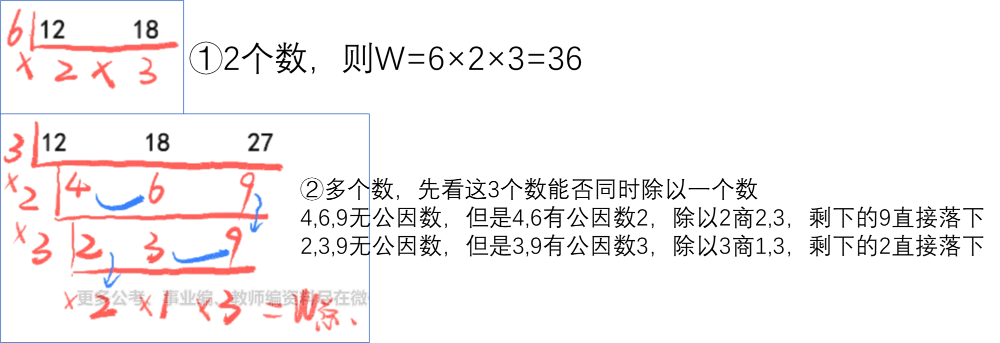
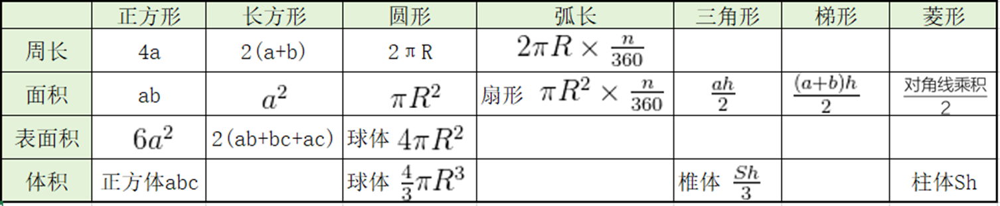
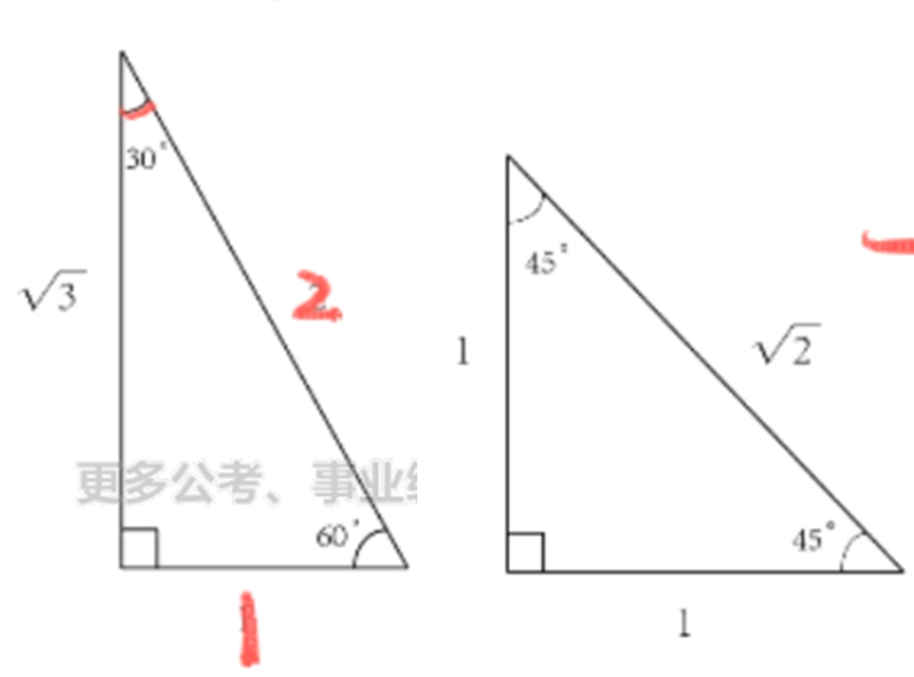
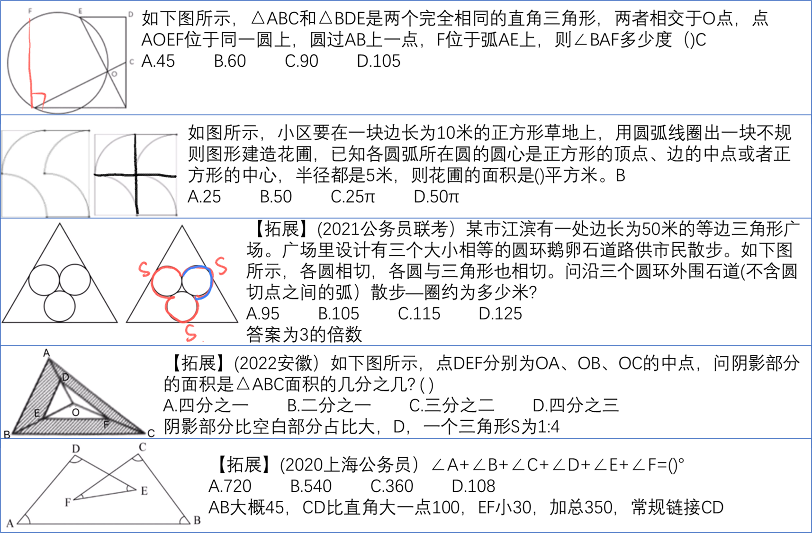
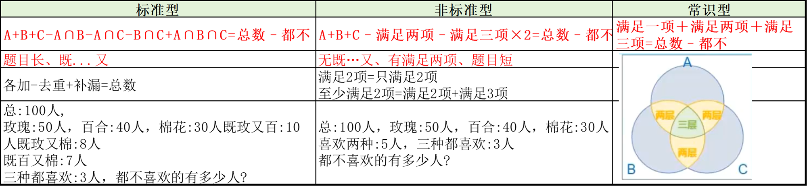
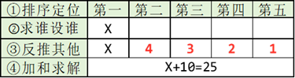
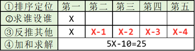

# 1.代入排除法

何时用：

- 看题型：
  - 年龄：年龄差不变
  - 余数问题：余、平均分、有剩余，常见分东西、排队等
  - 多位数：三四位数，出现位数的变化，优先验证对调情况，可以一步排除
  - 不定方程：未知数个数多余方程个数。
  - 【例】3x+2y=10，求: x、y 的值         A. 3、2        B. 2、2
- 看选项：选项是一组数，每组选项数字 ≥2 个。可以转换为一组数也算
  - 甲、乙两支足球队练习时共进球 20 个，甲队比乙队多进 8 个。两队分别多少个?
    - A.13，7        B.14，6        C.12，8        D.11，9
  - 甲队分别多少个?(乙队也知道了)
    - A.13        B.14        C.12        D.11
- 看题干：题干关系多，主体关系复杂，题意乱或难求解。想放弃时排除法挣扎

怎么用：剩二代一，必出答案（剩下 BD，代入 B 不符合，此时不需要再代入 D，直接选）
某选项满足所有条件，停下不用再代其他

先排除：利用奇偶、倍数、尾数等特性
再代入：

- ① 最值原则，问最大从最大开始代入，问最小从最小开始代入.
- ② 从简原则，好算，整十/整百优先代入
- ③ 居中代入：代入居中的选项，类似二分查找。适合单调性已知、方程好解的式子

# 2.倍数特性法

利用条件中的倍数特性来排除答案
平均分：

- 恰好分完：整除性
- 有余数：余数型

## 2.1 整除判定

① 口诀法：

- 2、5 看末一位
- 4、25 看末两位：4255 看 55 是不是 25 的倍数
- 3、9 看各位数字加和：1245819，凑齐 9 就划掉(1+8，4+5)，不用全加，麻烦
  ② 因式分解：分解时必须**互质**(2 个数除了 1 无其他公约数) 12=3×4**√**        12=2×6**×**
- 复杂倍数用因式分解，不用拆分
- 2 是唯一偶质数，1、0 不是质数也不是合数
  ③ 拆分：通用
- 231 是否为 7 的倍数，拆成：7 的若干倍 ± 小数字
- 231=210+21,210 和 21 都是 7 的倍数，故 231 也是 7 的倍数
- 4355 是否为 11 的倍数，4355=4400-45
- 4765 是否为 12 的倍数，不是，奇偶性
- 56784 是否是 12 的倍数，是 3N，是 4N，则也是 12N

## 2.2 余数型

余数型：平均分，有剩余/缺少

- 答案=ax±b $\longrightarrow$ 答案 ∓b 能被 a 整除
  **多退**：多几个/余几个/剩几个，多几个在总数上退几个，正正好好够分，
- **总数-多的=每次数 N 个 × 轮数**
  **少补**：少几个/缺几个/不够几个，少几个在总数上补几个，正正好好够分
- **总数-缺的=每次数 N 个 × 轮数**

  【例】一堆苹果平均每人分 10 个，还剩3 个，则苹果有多少个?  
  A.117        B.120        C.123        D.126
  总数=10× 人数+3，即总数-3=10× 人数，选项分别-3，看谁是 10 的倍数，C  
  【例】一堆苹果平均每人分 10 个，还缺 3 个，则苹果有多少个?
  总数=10× 人数-3，即总数+3=10× 人数，选项分别+3，看谁是 10 的倍数，A

  【例】三个运动员跨台阶，台阶总数在 100 ～ 150 级之间，第一 位运动员每次跨 3 级台阶，最后一步还剩 2 级台阶。第二位运动员每次跨 4 级台阶， 最后一步还剩 3 级台阶。第三位运动员每次跨 5 级台阶，最后一步还剩 4 级台阶。这 些台阶总共有（ ）级。
  A. 119        B. 121        C. 129        D. 131
  方法 1：多退少补，X-2=3N,X-3=4N,X-4=5N，先-4 验证 5N（好算）
  方法 2：跨 3 级台阶剩 2 级，补上 1 阶即可跨完，X+1=3N，跨 4 级剩 3 级，补上 1 阶即可跨完，X+1=4N，跨 5 级剩 4 级，补上 1 阶即可跨完，X+1=5N，即 X+1 同时为 3/4/5 的倍数

差同、合同、余同：除数和余数之间的关系

- 差同：公倍数做周期，减差。M÷5 余 4 差 1，M÷7 余 6 差 1 $\Rightarrow$ 35N-1
- 和同：公倍数做周期，加和。M÷5 余 4 和 9，M÷7 余 2 和 9 $\Rightarrow$ 35N+9
- 余同：公倍数做周期，加余。M÷5 余 1，M÷7 余 1 $\Rightarrow$ 35N+1

## 2.3 比例型(重点)

使用情况：出现分数、百分数、比例、倍数时，化简成最简整数比使用。从问题出发找比例，问哪个找哪个
(1)男女生人数之比是 3:5(比例)
(2)男生是女生人数的$\cfrac{3}{5}$(分数)
⑶ 男生是女生人数的 60%(百分数)
(4)男生是女生人数的 0.6 倍(倍数)

若$\cfrac{A}{B}=\frac{m}{n}$，（A、B 均为整数，$\cfrac{m}{n}$ 为最简整数比），则：

- A 是 m 的倍数，分子对分子
- B 是 n 的倍数，分母对分母
- A+B 是 m+n 的倍数，左边相加对右边相加
- A-B 是 m-n 的倍数，左边相减对右边相减

  已知某班级学生，$\cfrac{男生}{女生}=\frac{3}{5}$
  男同学人数是 3 的倍数；女同学人数是 5 的倍数；同学总数是 8 的倍数；
  女同学和男同学相差 2 的倍数(令男生=3x，女生=5x，相减为 2x)

原来袋子里红球与白球的数量之比为 19∶13。放入若干个红球后，红球与白球的数量之比变为 5∶3，再放入若干个白球后，红球与白球的数量之比为 13∶11。已知放入的红球比白球少 80 个。那么原来袋子里共有多少个球?( )D  
A 650        B 720         C840         D 960  
 步骤:  
 1.识别出现分数、百分数、比例、倍数，可考虑倍数特性  
 2.化成最简整数比：红/白=19/13,对应 4 条结论 3.看问题，选结论，来排除。用相加的结论，直接选，后面的数据留给做方程的人

<b>升级考法</b>：

- 男生人数比女生人数多$\cfrac{1}{5}$=男生比女生多女生的$\cfrac{1}{5}$=女生 5x，男生 6x=男/女=6/5
- A**比**B 少 1/7=A/B=(7-1)/7
- 黑球**比**白球多 3/8=黑/白=(3+8)/8
- **结论：谁比谁=谁 ÷ 谁**
  - **比字后面是分母，分母不变，**
  - **分子，若多，分母+分子；若少，分母-分子**
    甲比乙多$\cfrac{2}{7}$ $\Longrightarrow$ 甲：乙=9：7

# 3.方程法

方程法最后使用

1.普通方程：未知数个数=方程个数。设未知数、列方程、解方程

- 问谁设谁（A 是 B 的 2 倍，问 B）
- 设小不设大（A 是 B 的 2 倍，A 小）
- 设中间量（A 是 B 的 2 倍，B 是 C 的 3 倍）
- 有比例，设份数（A：B=3:4，设 A 为 3x，B 为 4x）
- 以坑治坑：两者为x 和 3x，选项为A.30        B.40        C.90        D.100，选 A 或者 C

  2.不定方程方法：带入排除法，ax+by=M

- ①**倍数特性**：常数项 M 可以与任意一个系数(a 或 b)约分。7y+3x=60，则 3x 与 60 都是**公约数**3 的倍数，则剩下的一项 7x 也是 3 的倍数
- ② 尾数特性：任意一个系数的尾数为 0 或 5
- ③ 奇偶特性：2 个系数一奇一偶。两数相乘，一偶则偶，全奇为奇
  - 7x+6y=47，7 和 6 一奇一偶，奇偶特性，6y 为偶数，结果为奇数，故 7x 为奇数
  - 尾数、倍数>奇偶特性
- 未知数是整数时的套路：消元
- 未知数不一定是整数时的套路：赋 0 法，让系数最大的未知数=0

# 4.工程问题

工作过程复杂：**画线段**

拓展：**短除法**

## 4.1 给完工时间型

给完工时间型：给出多个完工时间≠ 给时间

> 识别：一项工程，
> 甲乙合作8 天干完
> 甲先干6 天，乙再干8 天干完
> 问，甲先干2 天，乙再干几天干完？
> ↑ 一共有几个完工时间：1 个。不能拼接/前后干

PS：若没给时间，但是给了时间之间的关系，求时间：带入排除

> 甲比乙多 2 小时，求 $T_甲$

> ①赋总量：完工时间的公倍数（短除法），设置为 1 不好算
> ②算效率：效率=总量 ÷ 时间
> ③ 根据工作过程列式求解：最难
> 根据时间段：甲乙合作 15 小时后，甲离开，乙单独工作 t 小时完成
> 根据人头：每人每机器效率赋值为 1

搬一堆砖，甲单干要 4 个小时，乙单干要 6 个小时，甲乙合作要多久完成？
设总量 W=12，P 甲=W/4=3，P 乙=W/6=2，T 合作=$\cfrac{W}{\frac{W}{4}+\frac{W}{6}}$，W 约掉，故赋值无影响

## 4.2 给效率比例型

给效率比例型：给多个工作效率的比例关系

> ①赋效率：满足比例即可
> 直接给效率
> 间接给效率：A4 天的量 **=** B3 天的量 $\Longrightarrow$ A:B=3:4 ，**工作量一定，P 和 T 成反比**
> 出现多个时间，但是不是完工时间型，考虑间接效率比例型
> ②算总量：总量 W=P×T
> ③ 根据工作过程列式求解：最难

## 4.3 给具体单位型

给具体单位型：方程法。设未知数，列方程求解

> 给 W：要修 5000 米的路；要栽 1000 棵树
> 给 P：每天修 300 米；每天栽 100 棵树

## 4.4 牛吃草问题

    有增长有消耗，出现排比句
    抽水机抽水、挖沙机挖沙、窗口售票

公式：`Y=（N-X）T`
Y：原有草量——消耗量
N：牛吃草的效率——消耗
牛吃草的效率一般用牛头数来表示，即赋值每头牛效率 v=1
X：草生长的效率——新增
T：牛吃草的时间——消耗时间

## 4.5 帮忙问题

**谁牛帮谁少**：
甲、乙、丙三人完成同一幅拼图的的间分别需要 1 小时、1.2 小时、1.5 小时。现在有两幅拼图需要甲、乙完成，两人同时开始，丙刚开始帮助甲拼拼图，后来又帮助乙拼，最后两个拼图同时完成。问丙分别帮助甲、乙多长时间?
A.0.1 小时、0.3 小时 B.0.3 小时、0.5 小时 C.0.5 小时、0.6 小时 D.0.6 小时、0.2 小时

# 5.经济利润问题

基础公式：

- 利润=售价－成本
- **利润率=$\cfrac{利润}{成本}$**，资料分析分母是 ÷ 收入
- **售价=成本 ×（1+利润率）**
- 折扣=$\cfrac{折后价}{折前价}$，折扣=小的数值/大的数值
- 总价=单价 × 数量，总利润=单个利润 × 销量

方程法：题目中出现**具体金额，具体的数值+单位**

赋值法：**没有具体金额**，给比例，求比例时使用。**通常赋成品=100，销量=10 件**

分段计费：生活中的水电费、出租车计费、税费等，每段计费标准不同

- 按标准，分开；计算后，汇总

函数最值：单价和销量此消彼长，问何时总价或总利润最高

- 设提价或降价次数为 X，列出总价或总利润的函数表达式
- 令函数的 2 个括号内分别为 0，解得$X_1$和$X_2$
- 当 X=$X=\frac{X_{1}+X_{2}}{2}$ 时，即 X 介于 2 者中间，总价或总利润取得最值

# 6.行程问题

## 6.1 普通行程

基础公式：路程=速度 × 时间。1m/s=3.6km/h

等距离平均速度：

- 适用题型：等距离两段、直线往返、上下坡往返
- **公式**：$\bar{V}=\frac{2V_1 ×V_2}{V_1 +V_2}$

匀变速运动：

- **匀变速运动的平均速度=(初速度+末速度)/2。**
- 如果有多个变速过程，需要分别计算平均速度

火车过桥：路程=桥长+车长

- 火车完全在桥上：路程=桥长-车长

## 6.2 相对行程

- 直线相遇：两人同时相向而行，开始相遇时两人之间的距离=$S_和=V_和 ×T_遇$
- 直线追及：两人同时同向而行，开始追及时两人之间的距离=快的比慢的多走的距离=$S_差=V_差 ×T_差$
- 直线两端出发，多次相遇：$S_和=(2N-1)圈长度=V_和 ×T_遇$

- 环形相遇：同时同点反向出发，$S_和=N圈长度=V_和 ×T_遇$
- 环形追及：同时同点同向出发，$S_差=N圈长度=V_差 ×T_追$
- **环形不同点出发**：第一次相遇不用走剩下一半的路，第二次相遇即为同点出发。注意谁追谁，可能是长的那条弧线，△ 不同
  - 相遇 N 次：S 和=起点之间的距离+(N-1)圈
  - 追及 N 次：S 差=起点之间的距离+(N-1)圈

流水行船问题：$V_顺=V_船 +V_水$，$V_逆=V_船 -V_水$

比例行程问题：往往只有路程或只有时间，缺少数据。
某地突发森林火灾，现有甲、乙两支消防队离火灾发生地距离相同，但路况不同，假设两支队伍接到命令后同时出发，并且按照一定速度匀速赶往火灾现场参与救援。已知当甲消防队走了 1/3 路程时，乙消防队走了 9 公里，当乙消防队走了 1/3 路程时，甲消防队走了 16 公里，问甲消防队到达目的地时，乙消防队距离目的地还有多少公里？
A.9        B.12        C.27        D.36
时间相等时，路程与速度成正比。$\cfrac{V_{1}}{V_{2}}=\frac{S_{1}}{S_{2}}=\frac{\frac{1}{3}S}{9}=\frac{16}{\frac{1}{3}S}$
S 一定，V 与 T 成反比。主流考法:同一条路，甲乙两人走过花费的时间不同
T 一定，S 与 V 成正比。其主流考法:当甲..时，乙…  
 V 一定，S 与 T 成正比。考得较少

# 7.**几何：这几年大火**

规则图形直接用公式，不规则图形转换为规则图形（割、补）平移

圆锥表面积$S=πRl$，R 是底面半径

勾股定理：$a^2+b^2=c^2$，常见勾股数 3-4-5，6-8-10，5-12-13，7-24-25

- 求长度：构造一个特殊三角形（如直角三角形，用勾股定理、三角函数）
- 相似三角形：对应边之比为相似比，面积之比为相似比的平方
- 底（高）相同的三角形，面积之比等于高（底）之比
- 30°：60°：90° 的边=1：$\sqrt(3)$：2
- 45°：45°：90° 的边=1：1：$\sqrt(2)$

- 

平面最短：

- 2 点**同侧**：**镜面对称再连接**
- 2 点异侧：直接连线

有图就看图：

一辆汽车第一天行驶了 5 个小时，第二天行驶了 600 公里，第三天比第一天少行驶 200 公里，三天共行驶了 18 个小时。已知第一天的平均速度与三天全程的平均速度相同，问三天共行驶了多少公里?B
A.800        B.900        C.1000        D.1100                                
S=VT=18T，18 的倍数

甲车上午 8 点从 A 地出发匀速开往 B 地，出发 30 分钟后乙车从 A 地出发以甲车 2 倍的速度前往 B 地，并在距离 B 地 10 千米时追上甲车。如乙车 9 点 10 分到达 B 地，则甲车的速度为（）千米/小时。A  
 A.30        B.36        C.45        D.60                
A×2=D，猜 D 为乙车速度，坑，A 为甲车速度

# 8.排列组合

## 8.1 基本概念

分类与分步：

- 分类用加法：要么……要么……
- 分步用乘法：既……又……

排列：与顺序有关（改变顺序，结果变化）

- $A_n^m$=从 n 开始往下乘 m 个数，$A_n^m$=4×3×2
- 照相：ABC 与 BCA
- 洒水+扫地：AB 与 BA

组合：与顺序无关（改变顺序，结果不变）

- $C_n^m$=$\cfrac{从n开始往下乘m个数}{从m开始往下乘m个数}=\frac{A_n^m}{A_m^m}$，$C_8^3$=$\cfrac{8×7×6}{3×2×1}**\frac{有顺序}{上角标的顺序}=无顺序$
- 扫地：ABC 与 BAC
- 全组合结果为 1，$C_n^n$=1
- $C^{m}_n = C^{n-m}_n,C^{3}_8 = C^{5}_8$
- 选 1 个不存在顺序，$A^{1}_n = C^{1}_n=n$

判断是否要顺序：
`第一个选A，第二个选B`和`第一个选B，第二个选A`看是否有影响

枚举法：数据不大、选项都 ≤10 个

- 别漏了，同一标准。从大到小从小到大

- **捆绑法：必须相邻**
  - ① 先捆绑，把相邻的捆绑起来看成一个整体
  - ② 再排列组合，把捆后的“整体”与其他进行排列组合
  - 注意捆绑过程需考虑内部有无顺序
- 反面思考：正面困难、至少 N 个、不都/全。满足条件=总情况-不满足

## 8.2 插空法/插板法

插空法：不能相邻

- ① 先排列组合：先安排可以相邻的元素，形成若干个空位
- ② 再插空：将不相邻的元素插入到空位中。注意空位个数

**插板法进阶**：将 n 个相同的元素分给 m 个人，每人至少分**X**个该元素。则每人先分(**X-1**)个该元素，余下的元素再用隔板法进行二次分配
25 个相同的苹果分给三个小朋友，每人至少分6个，问有多少种分法？
先每人给5个，余下的元素再插板法

**插板法进阶 2**：打造出“还需要至少 1 个”的模型
将 13 个相同的小球放入编号分别为 1，2，3 的三个盒子中，要求每个盒子中的球数不少于它的编号数，则共有多少种放法？
分析：即 1 号盒子里面至少有 1 个，2 号盒子里面至少有 2 个，3 号盒子里面至少 3 个。先给 1 号盒子 0 个，2 号盒子 1 个，3 号盒子 2 个，打造出“还需要至少 1 个”的模型

剩下 10 个插板法

## 8.3 错位重排

n 个元素，全打乱顺序后重新排列，元素均不回到原位置。借调人员、互换车位、交叉审核等
<b>背住</b>：$D_{1}=0,D_{2}=1,D_{3}=2,D_{4}=9,D_{5}=44,D_{6}=265$
了解：$D_{n}=(n-1)\times (D_{n-1}\times D_{n-2})$

部分错位：n 个元素中有 m 个元素重排后发生错位。先选出错位的元素，再错位重排，即$C_{n}^{m}\times D_{m}$

> 四个装药的瓶子都贴了标签，其中三个贴错了，那么，共有几种可能的贴法?
> $C_{4}^{3}\times D_{3}$

## 8.4 环形排列

**不考虑方位**，只考虑相对位置。**N 人环形全排列，有**$A_{n}^{m}\div n=A_{n-1}^{n-1}$**种情况**
4 人，顺序是 ABCD，相对位置不变，绕一圈有 4 种情况。

- 定住 A 不动，剩下的人有$A_{n-1}^{n-1}$
  > 6 个小朋友围成在·一圈做游戏，小华和小明需要挨在一起，问有多少种安排方法？A.360        B.240        C.120        D.48
  > 捆绑法：先捆绑，再排列捆好后看成一个人，÷ 看成一个人后的人数，$A_{2}^{2}\times A_{5-1}^{5-1}$
  > 插空法：先环牌一般的，再插入不相邻的(有顺序就用 A)

# 9.概率

给情况求概率，$概率=\frac{满足条件的情况数}{总情况数}$

给概率求概率：

- 分类：概率=各类概率的和
- 分步：概率=各步概率的乘积

## 9.9 跟屁虫问题

两人(物)要在相邻、同一排、列、队、车。分步求概率
方法：先放一个(随意放)，再放另一个

- 让其中一人任意找位置，$P_{1}=1$(必然事件)，N 个位置，里面有 N 种方法可选=N/N=1
- 让另一人去找，$P_{2}$
- 分步用乘法：$P=P_{1}\times P_{2}=P_{2}$
  - 教室有 5 排共 30 个座位，每排座位数相同，小张和小李随机入座，则他们坐在同一排的概率
  - 小张随便坐(100%)× 还剩 29 个位置，要想在同一排，只剩 5 个位置$\cfrac{5}{29}$=$\cfrac{5}{29}$

# 10.容斥原理

两集合：A+B -A∩B=总数–都不。每个区域不重不漏各加一次=总数
三集合：

- 标准：A+B+C -A∩B - A∩C -B∩C +A∩B∩C=总数–都不
- 非标：A+B+C–满足两项–满足三项 ×2=总数–都不
- 常识：满足一项＋满足两项＋满足三项=总数–都不

# 11.最值问题

## 11.1 最不利构造

最不利构造：至少...，保证...

- 至少...保证/一定有 N 个相同或类似表述
- 原则：构造最不利情况数+1。
- 方法：**① 分类，可能结合排列组合考 ② 每类取 N-1 个，不够的话就全取 ③ 结果+1**

  例:袋子原有 10 个红球，4 个蓝球
  ① 至少取出()个球．才能保证有 3 个球的颜色相同？  
   取 n=3 个，原来够 3 个的，先取 2 个（篮球取 2 个，红球也取 2 个），最后+1，共 5 个  
  ② 至少取出()个球，才能保证有 6 个球的颜色相同?
  取 n=6，原来不够 6 个的全取（篮球），原来够 6 个的先取 5 个（红球），最后+1 共 10 个

**最不利+排列组合**：
某商店有 a、b、c 三种口红，m、n 两种眼影，每位顾客均购买 1 支口红和 1 盒眼影。则至少有多少位顾客购买，才能保证有 3 位顾客购买的美妆搭配是相同的。
① 一共有 3×2=6 种情况 ②3 位顾客 n=3，总数=(3-1)×6+1

## 11.2 构造数列

    最、排名第几、最...最...，排名第几的最...
    体重最轻的最重多少斤，排名第二的最少多少分

特征：**和一定，求某个量的最大/最小值**
方法：排序定位(求谁设谁，画表)→反推其他→ 加和求解。结果是小数 → 问至少就上取整，至多下取整(大退小补)
解得 x=7.2，最少 7.2，答案=8；最多 7.2，答案=7

例:5 个人分 25 个苹果，每个人分得的苹果均为正整数。若每个人分得的苹果数**各不相同**，问:  
 (1)分得苹果数最多的人最多分得多少个?
其他人尽可能的小，**最少的人设置为 1**（此处不设置为 Y）

(2)分得苹果最多的人至少分得多少个?
其他人尽可能的多，\*\*第二比第一小&尽可能大=X-1

## 11.3 多集合反向构造

多集合反向构造：多个条件都满足的最少/至少。正向不好构造，**反向 → 加和 → 作差**
有 100 人，其中白的 80 人，富的 70 人，美的 60 人，问“白富美”至少有多少人?
问最多，木桶原理，直接 60，但是问的至少，正向不好构造
先反向：不白 20 人，不富 30 人，不美 40 人
再加和：20+30+40=90
最后做差：总-加和=100-90。就是满足情况的，问至少即为所求的不交叉

    - 方法①：反向→加和→作差
    - 方法②：将做法总结为公式：$=a_{1}+a_{2}+...+a_{n}-(n-1)S$=70+80+60-2×100

# 12.数字推理

一定会考：江浙、上海、广东省

## 12.1 基础数列

基础数列：等差数列、等比数列、质数数列(有 2)、合数数列、周期数列(数字循环、正负循环)、简单的递推数列(加减乘除)。

> 1，3，5，7，？        9 奇数数列/等差数列
> **2，3，5，7**，？        11 质数数列
> **1，2，3，5**，？        8 递推和数列，**1，1，2，3，5 也满足**

## 12.2 特征数列

<b>多重数列</b>：项数多 ≥7 项，先交叉再分组

> 交叉：奇数项和偶数项分别成规律。如**2**，3，**3**，6，**4**，12，**5**
> 分组：相邻两两分组或三三分组（较少），分组后看组内：加、减、乘、除。如(2，1)，(2，3)，(5，2)，(4，5)，(2，X)
> 项数多，先交叉，交叉不行，再分组：两两分组。
> 5,6/9,13/15,18/19,x。先加和试试 11，22，33，44。公差=11 的等差数列

<b>机械划分</b>：识别 ① 全是小数 ② 有 ± 等分隔符 ③ 大多数是多位数

> 解题思路：每个部分拆开：交叉看或者分组看
> ① 小数：小数点前、点后拆分，分为整数部分和小数部分。**存在倍数关系，优先考虑除法** > 分开看：整数、小数分别成规律(交叉)
> 一起看，**每个数的整数、小数**的规律(分组)
> ② 多位数：拆分成两个数或三个数。235，145：2+3=5，1+4=5
> ③ 有分隔符：按照分隔符拆分

<b>分数数列</b>：全部或大部分是分数。将整数化为分数

> 分子分母单调增减时：
> 分开看，分子分母分别成规律
> 一起看，两分数之间四则运算
> 分子分母不是单调增减时：反约分，分子分母同时扩大同倍，谁阻碍了单调趋势，就反约分谁

<b>作商数列</b>：两两作商。只要**存在倍数关系，优先考虑除法**。

> 特殊：每个相邻两数间，隐隐约约觉得有倍数关系，也是作商

<b>幂次数列</b>：数字本身是幂次数或在幂次数附近

> 普通幂次：直接转化成$a^{n}$找规律
> 修正幂次：先转化为普通幂次 ± 修正项，再找规律，特征数**64、27 附近**。
> 11²=121，12²=144，13²=169
> 14²=196，15²=225，16²=256
> 3³=27，4³=64，5³=125，6³=216
> $2^4$=16，$3^4$=81，$4^4$=256，$5^4$=625
> 2 的次方：2、4、8、16、32、64、128、256、512、1024
> ①$\cfrac{1}{a}=a^{-1}$
> ②$1=1^{n}=m^{0}$（m 为非零数）；$0=0^{n}$（n ＞ 0），即 0 和 1 的任意次方都是本身
> ③ 优**先转化唯一幂次数**，先避开 0、1，16，64，81 这些不唯一的
> ④ 常用$16=4^{2}=2^{4}，64=8^{2}=4^{3}=2^{6}，81=9^{2}=3^{3}，625=25^{2}=5^{4}$

<b>图形数列</b>：方阵、圆形

> ①**有中心凑中心**，无中心凑相等
> ② 先看每个图中，最大数位置是否一致。位置一致：优先**按行/按列凑大的数** 。不一致：优先**按行/按列/对角线加和**。

## 12.3 非特征数列

<b>多级数列</b>：无其他明显特征，数列一般变化平缓。两两作差>做两次差>作和

<b>递推数列</b>：保底使用

> ① 圈 3 个稍微大点又好算数(挨在一起)，有特殊圈特殊
> ② 找规律（加、减、乘、除、方），差距大直接上乘积递推 or 幂次递推，不用和差
> ③ 做验证

步骤：判断是否是基础数列 → 根据特征作特征数列 → 无特征：作差、递推

## 12.4 等差数列

等差数列：相邻两项的差值相等。**通项公式**：$a_{n}=(n-1)d$
极差公式：$a_{n}=a_{m}+(n-m)d$，已知第 m 项，推第 n 项，反之亦然
等差数列求和公式一：$S_{n}=(a_{1}+a_{n})\frac{n}{2}$
等差数列的平均数=中位数，公式二：$S_{n}=$**平均数(中位数)× 项数**。等差数列同时出现总数$S_{n}$和项数，使用公式 2

> 若等差数列为奇数项，中位数就是最中间的数
> 若等差数列为偶数项，中位数就是最中间两个数的平均数

# 12.小题型

## 12.1 星期问题

闰年：

- 非整百年份，年份能被 4 整除
- 整百年份，年份能被 400 整除

大月和小月：2 月闰年 29 天

周期余数：已知某天为周几，过 n 天后为周几

- 每过一个整周，星期数不变
- 今天星期二，过(1)周为星期(2)，过(N)周为星期(2)
- 过(7N)天为星期(2)，过(30)天为星期(4)
- **第 N 项=该周期的第 N 项**
  - 1 月 1 日是周一，1 月 16 日是周几？$\Longrightarrow$ 16÷7=2...2，一周的第 2 项，周二
- **过 N 天=第 N+1 天=该周期的 N+1 项** - 1 月 1 日是周一，过 16 日是周几？$\Longrightarrow$ 16÷7=2...2，一周的第 2+1 项，周三
  结论:
- ① 总天数 ÷7=周期数……余数(m），星期数往后推 m 天
- ② 过平年（没有闰日 2.29）星期数+1(365÷7=52……1)
- 过闰年(有闰日 2.29)星期数+2(366÷7=52……2)

星期推断：某月有若干个周几，问某天为周几

- 每连续的 7 天有完整的星期一至星期日
- 每个月有 4 个或 5 个星期 X，每连续 28 天，必有周一至周日各 4 天
  - 取一连续 28 天，求前/月初就取后 28 天，求后/月末就去月初 28 天
- 若星期 X 有 5 个：则最后一个该星期 X 一定是 29/30/31 号，最初一个星期 X 一定是 1/2/3 号
  - 1~28 号有 4 个星期五，剩下的 3 天 29,30,31 一定有 1 个是星期五
  - 4~31 号有 4 个星期五，剩下的 3 天 1,2,3 一定有 1 个是星期五

## 12.2 植树问题

段数=$\cfrac{总长}{间隔}$

- 1.两端植树：棵数=段数+1
- 2.单端植树/环形植树：棵数=段数。正方形、怪谜日眼型，环起来都算
- 3.楼间植树/两端都不植：棵数=段数-1
